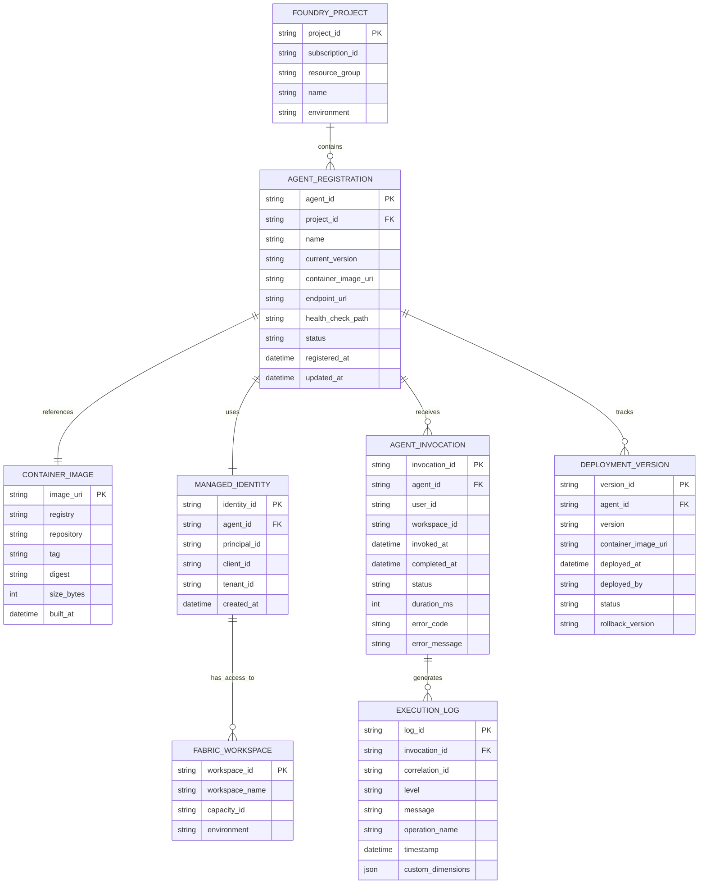
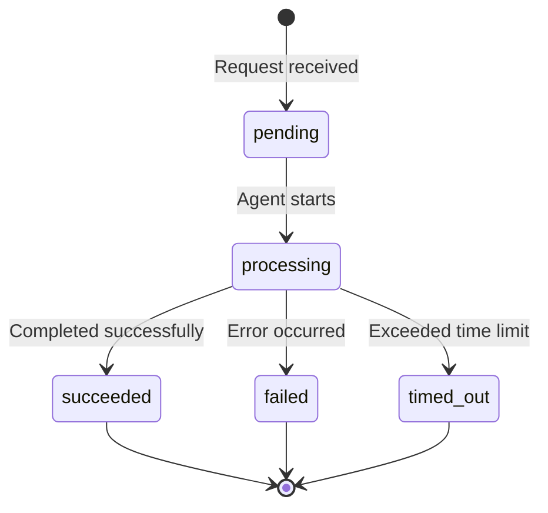
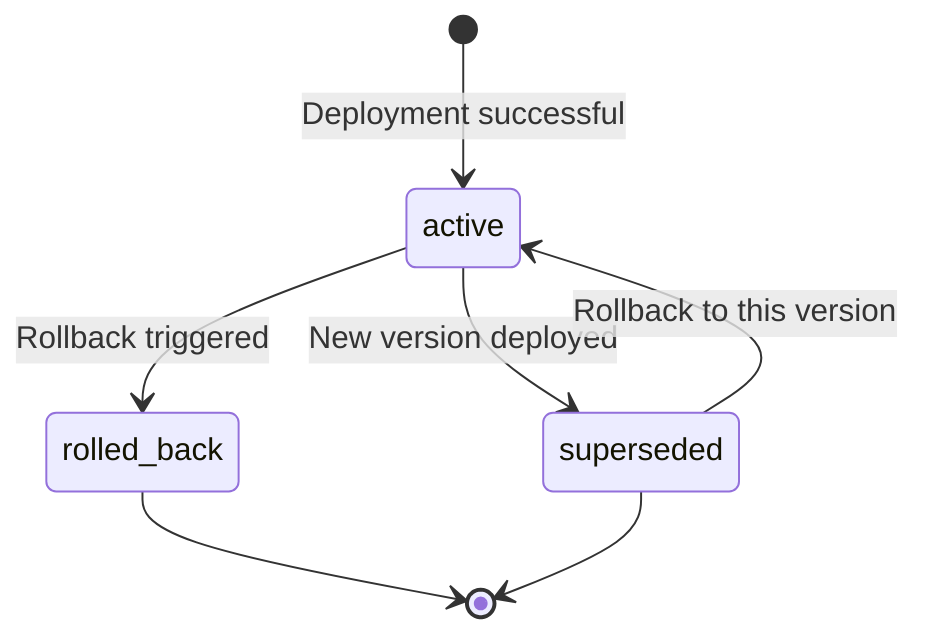

# Data Model: Foundry Agent Registration & Deployment

**Feature**: 001-foundry-agent-registration  
**Date**: 2026-02-05

## Entity-Relationship Diagram

<!-- BEGIN:AUTO-GENERATED section="er-diagram" -->

<!-- END:AUTO-GENERATED -->

---

## Entity Definitions

### Foundry Project

Represents an Azure AI Foundry workspace where agents are registered and managed.

**Fields**:
- `project_id` (uuid, PK): Unique identifier for the Foundry project
- `subscription_id` (uuid): Azure subscription containing the project
- `resource_group` (string): Azure resource group name
- `name` (string): Human-readable project name
- `environment` (enum): Environment type - `dev`, `staging`, `prod`

**Validation Rules**:
- `project_id` must be a valid Azure resource GUID
- `environment` must be one of the enumerated values
- `name` must be unique within subscription

**Relationships**:
- One project contains many agent registrations

---

### Agent Registration

Represents a registered agent instance within a Foundry project. Tracks the current deployed version and configuration.

**Fields**:
- `agent_id` (uuid, PK): Unique identifier for the agent registration
- `project_id` (uuid, FK → FOUNDRY_PROJECT): Parent Foundry project
- `name` (string): Agent name (must be unique within project)
- `current_version` (string): Semantic version currently deployed (e.g., `1.2.3`)
- `container_image_uri` (string): Full URI to container image (e.g., `myregistry.azurecr.io/agent:1.2.3`)
- `endpoint_url` (string): Agent invocation endpoint URL
- `health_check_path` (string): Relative path for health endpoint (default: `/health`)
- `status` (enum): Agent status - `active`, `degraded`, `inactive`, `deploying`
- `registered_at` (datetime): Initial registration timestamp
- `updated_at` (datetime): Last update timestamp

**Validation Rules**:
- `current_version` must follow semantic versioning (MAJOR.MINOR.PATCH)
- `container_image_uri` must be accessible from Foundry runtime
- `endpoint_url` must be HTTPS (except dev environment)
- `status` enum transitions: `deploying` → `active`, `deploying` → `inactive` (on failure), `active` → `degraded` → `active`, `active` → `inactive`

**Relationships**:
- Belongs to one Foundry project
- References one container image (current deployment)
- Uses one managed identity
- Receives many invocations
- Tracks many deployment versions (history)

---

### Container Image

Represents a Docker container image containing agent code and dependencies.

**Fields**:
- `image_uri` (string, PK): Full image URI including tag (e.g., `myregistry.azurecr.io/agent:1.2.3`)
- `registry` (string): Container registry hostname
- `repository` (string): Repository name
- `tag` (string): Image tag (semantic version or commit SHA)
- `digest` (string): SHA256 digest for immutable reference (e.g., `sha256:abc123...`)
- `size_bytes` (bigint): Uncompressed image size in bytes
- `built_at` (datetime): Image build timestamp

**Validation Rules**:
- `size_bytes` must be ≤ 2GB (2,147,483,648 bytes)
- `digest` must be SHA256 format
- `tag` should follow semantic versioning or be a git commit SHA

**Relationships**:
- Referenced by one agent registration (current version)
- Referenced by many deployment versions (history)

---

### Managed Identity

Represents an Azure system-assigned managed identity used for agent authentication to Fabric and other Azure services.

**Fields**:
- `identity_id` (uuid, PK): Managed identity resource ID
- `agent_id` (uuid, FK → AGENT_REGISTRATION): Associated agent
- `principal_id` (uuid): Azure AD principal ID (used for role assignments)
- `client_id` (uuid): Application/client ID
- `tenant_id` (uuid): Azure AD tenant ID
- `created_at` (datetime): Identity creation timestamp

**Validation Rules**:
- Lifecycle tied to agent registration (deleted when agent is deregistered)
- `principal_id` must be unique across Azure AD tenant

**Relationships**:
- Belongs to one agent registration
- Has access to many Fabric workspaces (via role assignments)

---

### Agent Invocation

Represents a single execution of the agent triggered by a user or system through Foundry.

**Fields**:
- `invocation_id` (uuid, PK): Unique identifier for this invocation
- `agent_id` (uuid, FK → AGENT_REGISTRATION): Agent that processed the request
- `user_id` (string): User or service principal ID that initiated the request
- `workspace_id` (uuid, FK → FABRIC_WORKSPACE): Target Fabric workspace
- `invoked_at` (datetime): Request start timestamp
- `completed_at` (datetime, nullable): Request completion timestamp
- `status` (enum): Invocation status - `pending`, `processing`, `succeeded`, `failed`, `timed_out`
- `duration_ms` (int): Execution duration in milliseconds
- `error_code` (string, nullable): Error code if failed (e.g., `WORKSPACE_ACCESS_DENIED`)
- `error_message` (string, nullable): Human-readable error message

**Validation Rules**:
- `duration_ms` must be ≥ 0
- `completed_at` must be > `invoked_at` when status is terminal (`succeeded`, `failed`, `timed_out`)
- `status` enum transitions: `pending` → `processing` → (`succeeded` | `failed` | `timed_out`)
- If `status` is `failed` or `timed_out`, `error_code` and `error_message` must be populated

**Relationships**:
- Belongs to one agent registration
- Targets one Fabric workspace
- Generates many execution logs

**State Transitions**:



---

### Execution Log

Represents a structured log entry from agent execution, correlated to an invocation.

**Fields**:
- `log_id` (uuid, PK): Unique identifier for the log entry
- `invocation_id` (uuid, FK → AGENT_INVOCATION): Associated invocation
- `correlation_id` (string): Distributed trace correlation ID
- `level` (enum): Log level - `DEBUG`, `INFO`, `WARNING`, `ERROR`, `CRITICAL`
- `message` (string): Log message text
- `operation_name` (string): Operation being performed (e.g., `validate_workspace`, `deploy_model`)
- `timestamp` (datetime): Log entry timestamp
- `custom_dimensions` (json): Additional structured data (e.g., `{"workspace_id": "...", "model_name": "..."}`)

**Validation Rules**:
- `level` must be one of the enumerated values
- `correlation_id` must match across all logs for a single invocation
- `timestamp` must be within reasonable bounds of invocation timeframe

**Relationships**:
- Belongs to one agent invocation

---

### Fabric Workspace

Represents a Microsoft Fabric workspace where semantic models are deployed.

**Fields**:
- `workspace_id` (uuid, PK): Fabric workspace GUID
- `workspace_name` (string): Human-readable workspace name
- `capacity_id` (uuid): Fabric capacity ID
- `environment` (enum): Environment classification - `dev`, `staging`, `prod`

**Validation Rules**:
- `workspace_id` must be accessible via Fabric APIs
- `environment` classification should match agent registration environment

**Relationships**:
- Accessible by many managed identities (via role assignments)
- Targeted by many agent invocations

---

### Deployment Version

Represents a historical record of agent version deployments for auditing and rollback purposes.

**Fields**:
- `version_id` (uuid, PK): Unique identifier for this deployment record
- `agent_id` (uuid, FK → AGENT_REGISTRATION): Associated agent
- `version` (string): Semantic version deployed (e.g., `1.2.3`)
- `container_image_uri` (string): Container image URI for this version
- `deployed_at` (datetime): Deployment timestamp
- `deployed_by` (string): User or service principal that performed deployment
- `status` (enum): Deployment status - `active`, `superseded`, `rolled_back`
- `rollback_version` (string, nullable): Version to rollback to if this deployment fails

**Validation Rules**:
- `version` must follow semantic versioning
- Only one `active` version per agent at a time
- When new version deploys, previous `active` becomes `superseded`

**Relationships**:
- Belongs to one agent registration
- References one container image

**State Transitions**:



---

## Configuration Models

### Agent Invocation Request

Represents the input schema for agent invocation via Foundry.

**Schema**:
```json
{
  "schema_source": {
    "type": "csv_url",
    "url": "https://...",
    "sample_rows": 100
  },
  "workspace_id": "uuid",
  "deployment_mode": "dry_run",  // dry_run | deploy
  "options": {
    "detect_measures": true,
    "detect_hierarchies": true,
    "target_optimization": "direct_lake"
  }
}
```

**Validation**:
- `schema_source.type` must be one of: `csv_url`, `sql_schema`, `lakehouse_schema`, `tableau_twb`
- `workspace_id` must be a valid Fabric workspace GUID accessible by agent
- `deployment_mode`: `dry_run` generates artifacts without deploying, `deploy` executes deployment
- All URL references must be accessible from agent runtime

---

### Agent Invocation Response

Represents the output schema from successful agent invocation.

**Schema**:
```json
{
  "invocation_id": "uuid",
  "status": "succeeded",
  "duration_ms": 120000,
  "artifacts": {
    "tmsl_url": "https://...",
    "tmdl_url": "https://...",
    "validation_report_url": "https://..."
  },
  "deployment": {
    "model_id": "uuid",
    "workspace_id": "uuid",
    "deployed_at": "2026-02-05T12:34:56Z"
  },
  "diagnostics": {
    "warnings": ["High cardinality detected in dimension X"],
    "anti_patterns": []
  }
}
```

**Validation**:
- `status` indicates final invocation state
- `artifacts` URLs must be accessible for 24 hours minimum
- `deployment` section only present if `deployment_mode` was `deploy`

---

### Health Check Response

Represents the output schema from agent health endpoint.

**Schema**:
```json
{
  "status": "healthy",
  "version": "1.2.3",
  "checks": {
    "application": "healthy",
    "fabric_connectivity": "healthy",
    "memory_usage_mb": 512,
    "uptime_seconds": 3600
  },
  "timestamp": "2026-02-05T12:34:56Z"
}
```

**Validation**:
- `status` must be one of: `healthy`, `degraded`, `unhealthy`
- `checks.memory_usage_mb` < 80% of configured limit → `healthy`, > 95% → `unhealthy`
- All fields must be populated within 5 seconds

---

## Summary

This data model captures the core entities and relationships for Foundry agent registration and deployment. Key design decisions:

- **Immutable deployment history**: `DEPLOYMENT_VERSION` maintains audit trail
- **Correlation for distributed tracing**: `correlation_id` links logs across invocation lifecycle
- **State machine validation**: Explicit status enums with transition rules prevent invalid states
- **Environment isolation**: `environment` field enables multi-environment deployment with appropriate access controls
