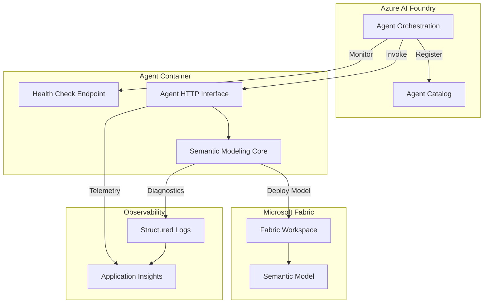

# Implementation Plan: Foundry Agent Registration & Deployment

**Branch**: `001-foundry-agent-registration` | **Date**: 2026-02-05 | **Spec**: [spec.md](spec.md)
**Input**: Feature specification from `/specs/001-foundry-agent-registration/spec.md`

**Note**: This template is filled in by the `/doit.planit` command. See `.github/prompts/doit.planit.prompt.md` for the execution workflow.

## Summary

This feature implements the foundational infrastructure for deploying the Power BI Semantic Modeling Agent to Azure AI Foundry. It enables operations engineers to package the agent as a container, register it in Foundry, and make it available for invocation by authorized users. The implementation includes container packaging, Foundry registration, managed identity setup, health monitoring, logging integration, and versioned deployment support with approval gates for production.

## Technical Context

**Language/Version**: Python 3.11+
**Primary Dependencies**: azure-ai-projects (Foundry SDK), azure-identity (managed identity), FastAPI (agent HTTP interface), pydantic (request/response validation)
**Storage**: Stateless agent - no persistent storage required (uses Fabric workspaces as deployment target)
**Testing**: pytest (unit and integration), docker (container testing), Azure CLI (infrastructure validation)
**Target Platform**: Azure AI Foundry (containerized Python agent), Linux container runtime
**Project Type**: Single service (agent with HTTP/health endpoints)
**Performance Goals**: Health check <5s response, agent invocation <3min end-to-end, 10+ concurrent requests, startup <60s
**Constraints**: Container size <2GB, memory usage <2GB under load, CPU <2 cores during processing
**Scale/Scope**: MVP deployment (single agent registration), 10 concurrent users, dev/staging/prod environments

## Architecture Overview

<!--
  AUTO-GENERATED: This section is populated by /doit.planit based on Technical Context above.
  Shows the high-level system architecture with component layers.
  Regenerate by running /doit.planit again.
-->

<!-- BEGIN:AUTO-GENERATED section="architecture" -->

<!-- END:AUTO-GENERATED -->


## Constitution Check

*GATE: Must pass before Phase 0 research. Re-check after Phase 1 design.*

✅ **Autonomy & Tooling**: Agent is tool-enabled and autonomous. Human-in-the-loop gates required for production deployments (satisfied by deployment approval workflow).

✅ **Fabric-First Semantic Modeling**: Agent targets Microsoft Fabric workspaces and Power BI semantic models using TMSL/TMDL and Fabric APIs.

✅ **Data Governance & Security**: Managed identity used for authentication, secrets stored in Azure Key Vault, audit trails maintained in Application Insights, production deployments require approval.

✅ **Observability, Testing & Diagnostics**: Health checks, structured logging to Application Insights, validation reports, pre/post-deploy checks, diagnostic strings on failures.

✅ **Idempotence, Versioning & Reproducibility**: Container images tagged with semantic versions, deployment scripts idempotent, rollback capability on failure.

✅ **Tech Stack Alignment**: Python 3.11+, Azure AI Foundry SDK, azure-identity, Fabric SDK, pytest, GitHub Actions, Terraform - all align with tech-stack.md.

**GATE STATUS**: ✅ **PASSED** - All constitution principles satisfied, no violations to justify.

## Project Structure

### Documentation (this feature)

```text
specs/[###-feature]/
├── plan.md              # This file (/doit.planit command output)
├── research.md          # Phase 0 output (/doit.planit command)
├── data-model.md        # Phase 1 output (/doit.planit command)
├── quickstart.md        # Phase 1 output (/doit.planit command)
├── contracts/           # Phase 1 output (/doit.planit command)
└── tasks.md             # Phase 2 output (/doit.taskit command - NOT created by /doit.planit)
```

### Source Code (repository root)

```text
src/
├── __init__.py
├── agent/
│   ├── __init__.py
│   ├── semantic_modeler.py      # Main agent logic
│   ├── foundry_handler.py        # NEW: Foundry invocation handler
│   └── health.py                 # NEW: Health check endpoint
├── artifacts/
│   ├── __init__.py
│   ├── tmdl_generator.py
│   └── tmsl_generator.py
├── core/
│   ├── __init__.py
│   ├── config.py                 # UPDATED: Add Foundry config
│   └── logging.py                # UPDATED: App Insights integration
├── fabric/
│   ├── __init__.py
│   ├── semantic_model_client.py  # Fabric deployment client
│   └── workspace_client.py       # Fabric workspace validation
├── modeling/
│   └── [existing modeling modules]
├── schema_parsers/
│   └── [existing parser modules]
└── validation/
    └── [existing validation modules]

tests/
├── conftest.py
├── integration/
│   ├── __init__.py
│   ├── test_agent_workflow.py
│   ├── test_foundry_registration.py  # NEW
│   └── test_health_monitoring.py     # NEW
└── unit/
    ├── __init__.py
    ├── [existing unit tests]
    ├── test_foundry_handler.py       # NEW
    └── test_health_endpoint.py       # NEW

terraform/                         # NEW: Infrastructure as code
├── main.tf
├── variables.tf
├── outputs.tf
├── resources.tf                   # Foundry agent registration
└── environments/
    ├── dev.tfvars
    ├── staging.tfvars
    └── prod.tfvars

.github/
└── workflows/
    ├── deploy-agent.yml           # NEW: Agent deployment pipeline
    └── validate-pr.yml            # UPDATED: Add container build

Dockerfile                         # NEW: Multi-stage container build
docker-compose.yml                 # NEW: Local testing
requirements.txt                   # UPDATED: Add azure-ai-projects
pyproject.toml                     # UPDATED: Add Foundry dependencies
```

**Structure Decision**: Single project structure (Option 1) - the agent is a standalone service with HTTP endpoints for health checks and Foundry invocation. Existing agent and modeling modules are extended with Foundry integration handlers. Infrastructure provisioning added via Terraform.

## Complexity Tracking

> No constitution violations - this section is not applicable.
