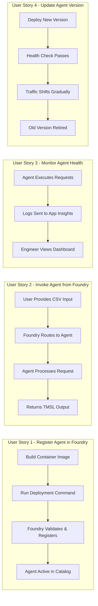
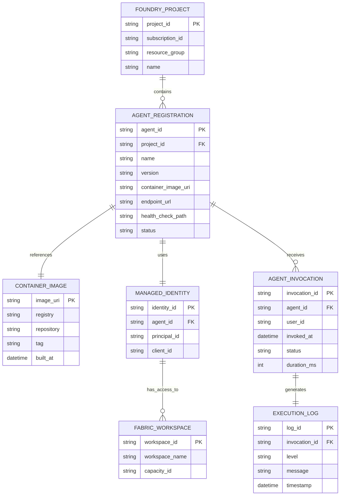

# Feature Specification: Foundry Agent Registration & Deployment

**Feature Branch**: `001-foundry-agent-registration`  
**Created**: 2026-02-05  
**Status**: Draft  
**Input**: User description: "Foundry Agent Registration & Deployment"

## User Scenarios & Testing *(mandatory)*

### User Story 1 - Register Agent in Foundry (Priority: P1)

An operations engineer packages the semantic modeling agent and registers it in Azure AI Foundry, making it available for invocation by authorized users and systems.

**Why this priority**: Without agent registration, the semantic modeling capabilities cannot be deployed or accessed. This is the foundational infrastructure requirement that enables all other functionality.

**Independent Test**: Can be fully tested by deploying an agent container to Foundry, registering it with the Foundry project, and verifying it appears in the Foundry agent catalog with "active" status.

**Acceptance Scenarios**:

1. **Given** agent container image is built and pushed to container registry, **When** engineer runs deployment command with Foundry project credentials, **Then** agent is registered in Foundry and shows "active" status
2. **Given** agent deployment configuration specifies required permissions (Fabric workspace access), **When** agent is registered, **Then** managed identity is created and granted specified permissions
3. **Given** agent is registered in Foundry, **When** engineer queries Foundry agent list, **Then** agent appears with correct name, version, and endpoint URL
4. **Given** agent registration includes health check endpoint, **When** Foundry monitors agent health, **Then** agent responds with healthy status within 5 seconds

---

### User Story 2 - Invoke Agent from Foundry (Priority: P1)

A data engineer invokes the registered agent through Foundry's interface, providing input schema and receiving semantic model output, without needing to understand infrastructure details.

**Why this priority**: Agent invocation is the core use case - users must be able to call the agent and receive results. This proves end-to-end integration works.

**Independent Test**: Can be fully tested by submitting a test request through Foundry UI or API with sample CSV schema, and verifying agent returns TMSL output and deployment status.

**Acceptance Scenarios**:

1. **Given** user has access to Foundry project, **When** they select the semantic modeling agent and provide CSV file URL, **Then** agent processes request and returns generated model within 2 minutes
2. **Given** agent receives invalid input (malformed CSV), **When** processing fails, **Then** user receives clear error message explaining what was invalid and how to fix it
3. **Given** multiple users invoke agent simultaneously, **When** requests are processed, **Then** each request is handled independently without cross-contamination of results
4. **Given** agent invocation includes workspace ID parameter, **When** agent executes, **Then** it validates workspace access before proceeding with model generation

---

### User Story 3 - Monitor Agent Health & Logs (Priority: P2)

An operations engineer monitors deployed agent health, reviews execution logs, and troubleshoots failures through Foundry's monitoring interface.

**Why this priority**: Observability is critical for production operation but not required for initial deployment testing. Can be added after core invocation works.

**Independent Test**: Can be fully tested by triggering successful and failed agent executions, then verifying logs appear in Application Insights with correct trace IDs and error details.

**Acceptance Scenarios**:

1. **Given** agent has processed 10 requests (8 successful, 2 failed), **When** engineer views agent metrics in Foundry, **Then** dashboard shows 80% success rate with latency percentiles
2. **Given** agent execution fails due to Fabric API error, **When** engineer reviews logs, **Then** log entry includes full diagnostic string from Fabric SDK and suggested remediation
3. **Given** agent has been running for 24 hours, **When** engineer checks health dashboard, **Then** uptime, request count, and error rate are displayed with 5-minute granularity
4. **Given** agent memory usage exceeds 80% threshold, **When** this occurs, **Then** alert is sent to ops team with pod restart recommendation

---

### User Story 4 - Update Agent Version (Priority: P2)

An operations engineer deploys a new version of the agent to Foundry, performing either blue-green deployment or rolling update without downtime.

**Why this priority**: Version updates are important for iteration but not required for initial MVP deployment. First version deployment is more critical.

**Independent Test**: Can be fully tested by deploying v1.0.0, making a small code change to create v1.1.0, deploying v1.1.0, and verifying old version requests complete while new requests route to new version.

**Acceptance Scenarios**:

1. **Given** agent v1.0.0 is running with active requests, **When** engineer deploys v1.1.0, **Then** in-flight v1.0.0 requests complete successfully before v1.0.0 is terminated
2. **Given** v1.1.0 deployment fails health check, **When** failure is detected, **Then** deployment rolls back to v1.0.0 automatically and engineer receives notification
3. **Given** engineer wants to test v1.1.0 in production, **When** canary deployment is configured at 10%, **Then** 10% of requests route to v1.1.0 while 90% use v1.0.0
4. **Given** v1.1.0 has been stable for 2 hours at 100% traffic, **When** engineer confirms success, **Then** v1.0.0 resources are deallocated

---

### Edge Cases

- What happens when agent container image pull fails due to registry authentication?
- How does system handle agent crash during request processing?
- What occurs if Foundry project quota for agents is exceeded?
- How are concurrent deployment attempts (two engineers deploying simultaneously) handled?
- What happens when agent registration references a Fabric workspace that doesn't exist or user lacks access?
- How does system respond to agent invocation with payload exceeding size limit?

## User Journey Visualization

<!-- BEGIN:AUTO-GENERATED section="user-journey" -->

<!-- END:AUTO-GENERATED -->

## Entity Relationships

<!-- BEGIN:AUTO-GENERATED section="entity-relationships" -->

<!-- END:AUTO-GENERATED -->

## Requirements *(mandatory)*

### Functional Requirements

- **FR-001**: System MUST package agent code and dependencies into a container image compatible with Azure AI Foundry runtime
- **FR-002**: System MUST register agent with Azure AI Foundry project using project ID, subscription ID, and resource group
- **FR-003**: System MUST create and assign a managed identity to the agent with permissions to access specified Fabric workspaces
- **FR-004**: System MUST expose a health check endpoint that returns HTTP 200 with JSON payload containing status and version within 5 seconds
- **FR-005**: System MUST accept agent invocations via Foundry's agent orchestration API with request schema containing input source (CSV URL, schema JSON) and target workspace ID
- **FR-006**: System MUST validate invocation requests and reject with HTTP 400 if required parameters are missing or malformed
- **FR-007**: System MUST route agent execution logs to Azure Application Insights with correlation IDs linking all operations for a single invocation
- **FR-008**: System MUST support versioned deployments with version string format MAJOR.MINOR.PATCH following semantic versioning
- **FR-009**: Agent registration MUST include endpoint URL that Foundry can invoke for request processing
- **FR-010**: System MUST authenticate agent-to-Fabric calls using the assigned managed identity, not user credentials
- **FR-011**: System MUST return structured error responses including error code, message, and diagnostic hints when invocation fails
- **FR-012**: System MUST support agent deregistration (removal from Foundry) without affecting historical invocation logs
- **FR-013**: Agent container MUST include all required Python dependencies (azure-ai-projects, azure-identity, semantic modeling libraries)
- **FR-014**: System MUST validate Fabric workspace access at invocation time and return permission error if access is denied
- **FR-015**: System MUST support concurrent invocations with isolated execution contexts (no shared state between requests)
- **FR-016**: Agent registration MUST specify resource limits (CPU, memory) to prevent runaway resource consumption
- **FR-017**: System MUST emit metrics for requests per minute, success rate, latency percentiles (p50, p95, p99), and error rate
- **FR-018**: System MUST support graceful shutdown, completing in-flight requests before terminating
- **FR-019**: Deployment process MUST create Foundry agent manifest specifying name, description, version, input schema, and output schema
- **FR-020**: System MUST support environment-specific configuration (dev, staging, prod) for Foundry endpoint and workspace IDs

### Key Entities

- **Foundry Project**: The Azure AI Foundry workspace where the agent is registered; contains project ID, subscription, resource group
- **Agent Registration**: The registered agent instance; includes name, version, container image URI, endpoint URL, and health status
- **Container Image**: The packaged agent code and dependencies; stored in Azure Container Registry with semantic version tag
- **Managed Identity**: Azure-managed service identity assigned to the agent; used for authenticating to Fabric without storing credentials
- **Agent Invocation**: A single execution of the agent triggered by user or system; tracked with invocation ID, timestamp, status, duration
- **Execution Log**: Structured log entries from agent execution; includes log level, message, timestamp, and correlation to invocation
- **Fabric Workspace**: Target Microsoft Fabric workspace where semantic models are deployed; identified by workspace ID

## Success Criteria *(mandatory)*

### Measurable Outcomes

- **SC-001**: Operations engineer can deploy agent from local machine to Azure AI Foundry in under 10 minutes using documented deployment script
- **SC-002**: Agent appears in Foundry agent catalog within 2 minutes of successful registration with "active" status
- **SC-003**: Agent health check responds within 5 seconds with valid status payload 100% of the time under normal operation
- **SC-004**: User can invoke agent through Foundry interface and receive successful response for valid CSV input within 3 minutes end-to-end
- **SC-005**: Agent handles 10 concurrent invocations without failures or resource exhaustion
- **SC-006**: All agent execution logs appear in Application Insights within 30 seconds of event occurrence with correct correlation IDs
- **SC-007**: Agent deployment failure (e.g., failed health check) results in automatic rollback without manual intervention
- **SC-008**: Version update from v1.0.0 to v1.1.0 completes without dropping any in-flight requests
- **SC-009**: Permission errors (workspace access denied) return within 5 seconds with actionable error message identifying missing permission
- **SC-010**: Agent startup time (container start to health check passing) is under 60 seconds
- **SC-011**: Documentation enables new team member to deploy agent to dev environment without assistance
- **SC-012**: Agent resource usage (CPU, memory) stays within configured limits during stress test with 25 concurrent requests

## Assumptions *(mandatory)*

- Azure AI Foundry project already exists with appropriate capacity and quotas
- Operations engineer has Contributor role on Foundry project and registry
- Azure Container Registry exists for storing agent container images
- Managed identity role assignments can be created via Terraform or Azure CLI
- Foundry supports Python-based agents with custom container images
- Application Insights workspace exists for log aggregation
- Network connectivity exists between Foundry runtime and Fabric API endpoints
- Agent invocations are authenticated at Foundry level before reaching agent (agent trusts Foundry requests)
- Development, staging, and production Foundry projects are in the same Azure subscription

## Out of Scope *(include if needed)*

- Foundry project creation and initial setup (assumed to exist)
- User authentication and authorization (handled by Foundry)
- Cost optimization and pod autoscaling configuration (future enhancement)
- Multi-region deployment and geo-redundancy (future enhancement)
- Advanced deployment strategies (A/B testing, feature flags) beyond basic blue-green
- Integration with external monitoring tools beyond Application Insights
- Agent SDK development for other languages (Python only for MVP)

## Dependencies *(include if applicable)*

- **Azure AI Foundry SDK** (azure-ai-projects): Required for agent registration and orchestration
- **Azure Identity SDK** (azure-identity): Required for managed identity authentication
- **Azure Container Registry**: Required for storing and pulling container images
- **Application Insights**: Required for logging and telemetry
- **Terraform or Azure CLI**: Required for infrastructure provisioning and role assignments
- **Docker**: Required for building container images locally
- **GitHub Actions or Azure Pipelines**: Required for CI/CD automation

## Open Questions

_No open questions - all requirements defined with reasonable defaults based on Azure AI Foundry best practices._
