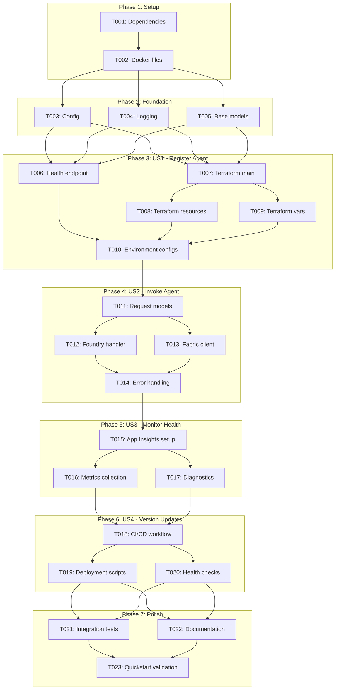
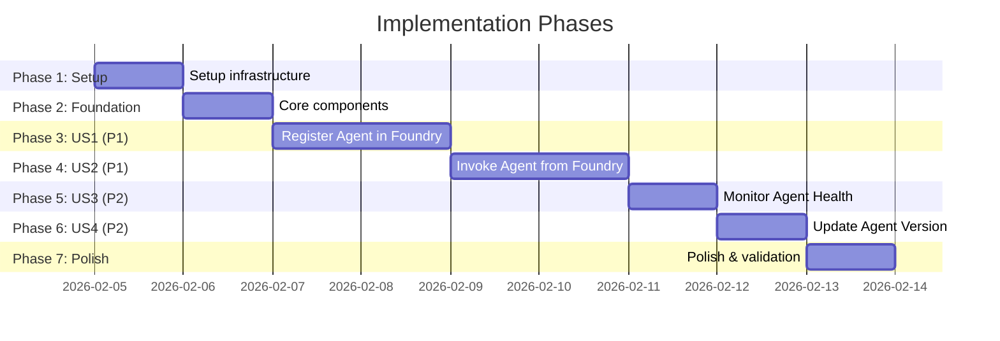

# Tasks: Foundry Agent Registration & Deployment

**Input**: Design documents from `/specs/001-foundry-agent-registration/`
**Prerequisites**: plan.md, spec.md, data-model.md, contracts/agent-api.yaml, research.md, quickstart.md

**Organization**: Tasks are grouped by user story to enable independent implementation and testing of each story.

## Task Dependencies

<!--
  AUTO-GENERATED: This section is populated by /doit.taskit based on task relationships.
  The flowchart shows task execution order and parallel opportunities.
  Regenerate by running /doit.taskit again.
-->

<!-- BEGIN:AUTO-GENERATED section="task-dependencies" -->

<!-- END:AUTO-GENERATED -->

## Phase Timeline

<!--
  AUTO-GENERATED: This section is populated by /doit.taskit based on phase structure.
  The gantt chart shows estimated phase durations and dependencies.
  Regenerate by running /doit.taskit again.
-->

<!-- BEGIN:AUTO-GENERATED section="phase-timeline" -->

<!-- END:AUTO-GENERATED -->

## Format: `[ID] [P?] [Story] Description`

- **[P]**: Can run in parallel (different files, no dependencies)
- **[Story]**: Which user story this task belongs to (e.g., US1, US2, US3, US4)
- Include exact file paths in descriptions

## Path Conventions

- **Single project**: `src/`, `tests/`, `terraform/` at repository root
- All paths shown below follow single project structure from plan.md

---

## Phase 1: Setup (Shared Infrastructure)

**Purpose**: Project initialization and dependency configuration

- [ ] T001 Update requirements.txt to add azure-ai-projects>=1.0.0, fastapi>=0.109.0, uvicorn[standard]>=0.27.0, pydantic>=2.5.0, opentelemetry-sdk>=1.22.0, opentelemetry-instrumentation-fastapi>=0.43b0
- [ ] T002 [P] Create Dockerfile with multi-stage build (build stage with Python 3.11-slim, runtime stage copying built wheels) in repository root
- [ ] T003 [P] Create docker-compose.yml with agent service, environment variables (AZURE_CLIENT_ID, FOUNDRY_PROJECT_ID, APP_INSIGHTS_CONNECTION_STRING), and port mapping 8000:8000 in repository root

---

## Phase 2: Foundational (Blocking Prerequisites)

**Purpose**: Core infrastructure that MUST be complete before ANY user story can be implemented

**⚠️ CRITICAL**: No user story work can begin until this phase is complete

- [ ] T004 Update src/core/config.py to add FoundryConfig class with fields: project_id, subscription_id, resource_group, agent_name, agent_version, environment (Enum: dev/staging/prod)
- [ ] T005 [P] Update src/core/logging.py to integrate Application Insights using OpenTelemetry SDK with correlation ID propagation from X-Correlation-ID header
- [ ] T006 [P] Create src/agent/__main__.py FastAPI application entrypoint with app instance, CORS middleware, and uvicorn server configuration
- [ ] T007 [P] Create Pydantic models for HealthResponse in src/agent/health.py (status, version, checks dict, timestamp fields per OpenAPI spec)
- [ ] T008 [P] Create Pydantic models for request schemas in src/agent/schemas.py: CsvSchemaSource, LakehouseSchemaSource, SqlSchemaSource, ModelingOptions, InvocationRequest per contracts/agent-api.yaml

**Checkpoint**: Foundation ready - user story implementation can now begin in parallel

---

## Phase 3: User Story 1 - Register Agent in Foundry (Priority: P1) 🎯 MVP

**Goal**: Package agent as container, register with Azure AI Foundry, create managed identity, expose health endpoint

**Independent Test**: Deploy container to Foundry, verify agent appears in catalog with "active" status, health check returns 200 OK within 5 seconds

### Implementation for User Story 1

- [ ] T009 [P] [US1] Implement GET /health endpoint in src/agent/health.py returning HealthResponse with application status check, Fabric connectivity check (call Fabric API /healthz), memory usage from psutil, uptime from process start time
- [ ] T010 [US1] Update src/agent/__main__.py to register /health route with health endpoint handler and configure startup event to initialize Fabric client connectivity check
- [ ] T011 [P] [US1] Create terraform/main.tf with required providers (azurerm >=3.0, azuread >=2.0), backend configuration for remote state, and locals for resource naming convention
- [ ] T012 [P] [US1] Create terraform/variables.tf with input variables: foundry_project_id, foundry_subscription_id, foundry_resource_group, acr_name, fabric_workspace_ids (list), agent_name, agent_version, environment
- [ ] T013 [US1] Create terraform/resources.tf with Azure Container Registry configuration (if creating new), managed identity resource (system-assigned), Foundry agent registration resource, role assignments (Fabric Workspace Admin on specified workspaces), Application Insights resource
- [ ] T014 [US1] Create terraform/outputs.tf exporting: managed_identity_client_id, managed_identity_principal_id, container_registry_login_server, agent_id, agent_endpoint_url, app_insights_connection_string, agent_status
- [ ] T015 [P] [US1] Create terraform/environments/dev.tfvars with dev environment values (per quickstart.md examples)
- [ ] T016 [P] [US1] Create terraform/environments/staging.tfvars with staging environment values
- [ ] T017 [P] [US1] Create terraform/environments/prod.tfvars with production environment values
- [ ] T018 [US1] Update Dockerfile to set LABEL org.opencontainers.image.version from build arg VERSION defaulting to "1.0.0" and add HEALTHCHECK command calling curl localhost:8000/health

**Checkpoint**: User Story 1 complete - agent container builds, registers in Foundry, health check responds successfully

---

## Phase 4: User Story 2 - Invoke Agent from Foundry (Priority: P1) 🎯 MVP

**Goal**: Accept invocation requests via HTTP, validate input, delegate to semantic modeling core, return artifacts and status

**Independent Test**: POST to /invoke with sample CSV URL, verify agent returns InvocationResponse with succeeded status and artifact URLs within 3 minutes

### Implementation for User Story 2

- [ ] T019 [P] [US2] Create Pydantic models for response schemas in src/agent/schemas.py: ArtifactUrls, DeploymentInfo, Diagnostics, InvocationResponse, ErrorResponse per contracts/agent-api.yaml
- [ ] T020 [US2] Create src/agent/foundry_handler.py with InvocationHandler class having async invoke() method accepting InvocationRequest, validating schema_source accessibility (HTTP HEAD request for CSV URL), checking workspace access via Fabric client
- [ ] T021 [US2] Implement workspace validation in src/fabric/workspace_client.py with WorkspaceClient class having async validate_access(workspace_id) method using managed identity to call Fabric API /workspaces/{id} and handle 403 permission errors
- [ ] T022 [US2] Update src/agent/foundry_handler.py InvocationHandler.invoke() to generate unique invocation_id (UUID), extract correlation_id from headers or generate new UUID, call semantic_modeler.generate() with schema source and options, measure duration
- [ ] T023 [US2] Implement POST /invoke endpoint in src/agent/foundry_handler.py with request validation (Pydantic model), correlation ID handling (extract from X-Correlation-ID header), invocation handler delegation, error handling for 400/403/500/504
- [ ] T024 [US2] Update src/agent/__main__.py to register /invoke route with foundry handler endpoint
- [ ] T025 [US2] Implement error response generation in src/agent/foundry_handler.py with error_code mapping (INVALID_REQUEST, WORKSPACE_ACCESS_DENIED, INTERNAL_ERROR, TIMEOUT), diagnostic details inclusion per contracts error examples
- [ ] T026 [US2] Update src/core/logging.py to log invocation start/end events with invocation_id, correlation_id, duration_ms, status as custom dimensions

**Checkpoint**: User Story 2 complete - agent accepts invocations, validates input, returns structured responses with artifacts

---

## Phase 5: User Story 3 - Monitor Agent Health & Logs (Priority: P2)

**Goal**: Route logs to Application Insights, emit metrics, enable dashboard monitoring and troubleshooting

**Independent Test**: Trigger successful and failed invocations, query Application Insights for logs with correct correlation IDs, verify metrics (success rate, latency percentiles) appear in dashboard

### Implementation for User Story 3

- [ ] T027 [US3] Update src/core/logging.py to configure OpenTelemetry metrics exporter for Application Insights with MetricReader pushing metrics every 60 seconds
- [ ] T028 [P] [US3] Implement metrics collection in src/agent/foundry_handler.py: Counter for requests_total (labels: status, error_code), Histogram for request_duration_seconds (buckets: 0.1, 0.5, 1, 5, 10, 30, 60, 120, 180), Gauge for concurrent_requests
- [ ] T029 [P] [US3] Update src/agent/health.py to add metrics for health_check_duration_seconds Histogram and health_check_failures_total Counter
- [ ] T030 [US3] Implement diagnostic string capture in src/agent/foundry_handler.py error handlers to extract exception traceback, Fabric SDK diagnostic info (if available from fabric client responses), and suggested remediation based on error_code
- [ ] T031 [US3] Update src/core/logging.py to add structured logging for all agent operations with fields: timestamp, level, message, operation_name, invocation_id, correlation_id, duration_ms, error_code, custom_dimensions (JSON)

**Checkpoint**: User Story 3 complete - logs flow to Application Insights, metrics tracked, engineers can monitor and troubleshoot via Azure Portal

---

## Phase 6: User Story 4 - Update Agent Version (Priority: P2)

**Goal**: Support blue-green deployment with semantic versioning, health-check-based traffic routing, rollback capability

**Independent Test**: Deploy v1.0.0, deploy v1.1.0, verify old version completes in-flight requests, new version receives new traffic, rollback works on health check failure

### Implementation for User Story 4

- [ ] T032 [P] [US4] Create .github/workflows/deploy-agent.yml with jobs: build (build and push container to ACR with tag from git describe --tags), deploy-dev (terraform apply for dev environment, no approval), deploy-staging (terraform apply for staging, auto-approve), deploy-prod (terraform apply for prod with environment protection rules requiring manual approval from designated reviewers)
- [ ] T033 [P] [US4] Create deployment script .github/scripts/deploy.sh (bash) accepting environment argument (dev/staging/prod), running terraform init, terraform plan with -var-file=environments/{env}.tfvars, terraform apply with auto-approve (dev/staging) or requiring manual approval (prod)
- [ ] T034 [US4] Update terraform/resources.tf to configure Foundry agent registration with health check monitoring (interval: 30s, timeout: 5s, unhealthy_threshold: 3, healthy_threshold: 2) and blue-green deployment strategy (keep old version running until new passes health checks for 2 minutes)
- [ ] T035 [US4] Implement graceful shutdown in src/agent/__main__.py with signal handlers (SIGTERM, SIGINT) setting shutdown event, waiting for in-flight requests to complete (max 30s grace period), closing Fabric client connections, flushing logs to Application Insights
- [ ] T036 [US4] Update terraform/resources.tf agent registration to include version label from agent_version variable, container image URI with full digest (sha256), and rollback configuration pointing to previous version on deployment failure
- [ ] T037 [US4] Add version detection to src/agent/__main__.py reading VERSION environment variable (set from Dockerfile LABEL during container build) and including in health check response version field and startup logs

**Checkpoint**: User Story 4 complete - CI/CD pipeline deploys versioned containers, blue-green deployment works, rollback automatic on failure

---

## Phase 7: Polish & Cross-Cutting Concerns

**Purpose**: Improvements that affect multiple user stories, final validation

- [ ] T038 [P] Create integration test tests/integration/test_foundry_registration.py verifying: container builds successfully, health endpoint responds 200 OK, Foundry registration succeeds (mocked or real dev environment), managed identity created
- [ ] T039 [P] Create integration test tests/integration/test_health_monitoring.py verifying: health checks log to Application Insights, metrics exported correctly, correlation IDs propagated through request lifecycle
- [ ] T040 [P] Create unit test tests/unit/test_foundry_handler.py with test cases: request validation (valid/invalid inputs), workspace access validation (success/permission denied), error response generation (all error codes), correlation ID handling
- [ ] T041 [P] Create unit test tests/unit/test_health_endpoint.py with test cases: health check success, degraded status (high memory), unhealthy status (Fabric unreachable), timeout handling
- [ ] T042 [P] Update README.md with agent architecture diagram, deployment prerequisites, quick start link to specs/001-foundry-agent-registration/quickstart.md, troubleshooting section
- [ ] T043 Validate quickstart.md end-to-end by following all 8 steps on clean environment, documenting any missing prerequisites or unclear instructions, updating quickstart as needed
- [ ] T044 [P] Add pre-commit hooks in .pre-commit-config.yaml for: black (code formatting), ruff (linting), mypy (type checking), pytest (run unit tests)
- [ ] T045 Security hardening: review Dockerfile for vulnerabilities (use official Python base, no root user, minimize layers), scan container image with trivy, update requirements.txt to latest patched versions

---

## Dependencies & Execution Order

### Phase Dependencies

- **Setup (Phase 1)**: No dependencies - can start immediately
- **Foundational (Phase 2)**: Depends on Setup completion - BLOCKS all user stories
- **User Stories (Phase 3-6)**: All depend on Foundational phase completion
  - US1 and US2 are both P1 (MVP) - US1 should complete first as it enables agent registration
  - US2 requires US1 for agent to be registered and health check working
  - US3 and US4 are P2 - can proceed after US1 and US2 complete
- **Polish (Phase 7)**: Depends on all user stories being complete

### User Story Dependencies

- **User Story 1 (P1)**: Can start after Foundational (Phase 2) - No dependencies on other stories
- **User Story 2 (P1)**: Can start after US1 completes (requires health endpoint and agent registration infrastructure)
- **User Story 3 (P2)**: Can start after US2 completes (requires invocation flow to monitor)
- **User Story 4 (P2)**: Can start after US2 completes (requires working deployment to add versioning)

### Within Each User Story

- **US1**: Terraform files can be created in parallel → then applied sequentially
- **US2**: Request/response models in parallel → handler and client in parallel → endpoint integration
- **US3**: Metrics and logging can be added in parallel
- **US4**: CI/CD and deployment scripts can be created in parallel → integration requires agent deployment working

### Parallel Opportunities

- Phase 1: T002 and T003 can run in parallel (different files)
- Phase 2: T005, T006, T007, T008 can all run in parallel (different files, no dependencies)
- Phase 3 (US1): T009, T011, T012 can start in parallel; T015, T016, T017 can run in parallel
- Phase 4 (US2): T019, T020, T021 can run in parallel initially
- Phase 5 (US3): T028 and T029 can run in parallel (different files)
- Phase 6 (US4): T032 and T033 can run in parallel
- Phase 7: All polish tasks (T038-T045) can run in parallel as they affect different files

---

## Implementation Strategy

### MVP First (User Stories 1 & 2 Only)

1. Complete Phase 1: Setup
2. Complete Phase 2: Foundational (CRITICAL - blocks all stories)
3. Complete Phase 3: User Story 1 (Register Agent in Foundry)
4. **VALIDATE**: Test container build, Foundry registration, health check
5. Complete Phase 4: User Story 2 (Invoke Agent from Foundry)
6. **VALIDATE**: Test end-to-end invocation with sample CSV
7. **STOP and DEMO**: MVP ready for stakeholder review

**Estimated MVP Timeline**: 5-6 days with 1 developer

### Incremental Delivery

1. Complete Setup + Foundational (Days 1-2)
2. Complete US1: Register Agent (Days 3-4) → **Deploy to dev, demo registration**
3. Complete US2: Invoke Agent (Days 5-6) → **Deploy to dev, demo invocation**
4. Complete US3: Monitor Health (Days 7) → **Deploy to staging, validate monitoring**
5. Complete US4: Version Updates (Days 8) → **Deploy to prod, validate CI/CD**
6. Complete Polish (Days 9) → **Final validation and documentation**

**Full Feature Timeline**: 9 days with 1 developer

### Parallel Team Strategy

With 2-3 developers:

1. **Team completes Setup + Foundational together** (Day 1)
2. **Developer A**: User Story 1 (Days 2-3)
3. **Developer B**: Starts User Story 2 foundations in parallel with A (request models, schemas)
4. **Developer A** → Helps complete US2 after US1 (Days 4-5)
5. **Developer C**: User Story 3 once US2 invocation flow exists (Day 6)
6. **Developer B**: User Story 4 (Day 6-7)
7. **All developers**: Polish tasks in parallel (Day 8)

**Parallel Timeline**: 8 days with 2-3 developers

---

## Notes

- [P] tasks = different files, no dependencies - can run truly in parallel
- [Story] label (US1, US2, US3, US4) maps task to specific user story for traceability
- Each user story should be independently completable and testable
- Commit after each task or logical group for clean git history
- Stop at any checkpoint to validate story independently before proceeding
- MVP = US1 + US2 (register and invoke agent) - sufficient for initial demo and feedback
- All file paths are relative to repository root unless otherwise specified
- Follow docker multi-stage build pattern to minimize final image size (<2GB target)
- Use managed identity authentication everywhere - no secrets in code
