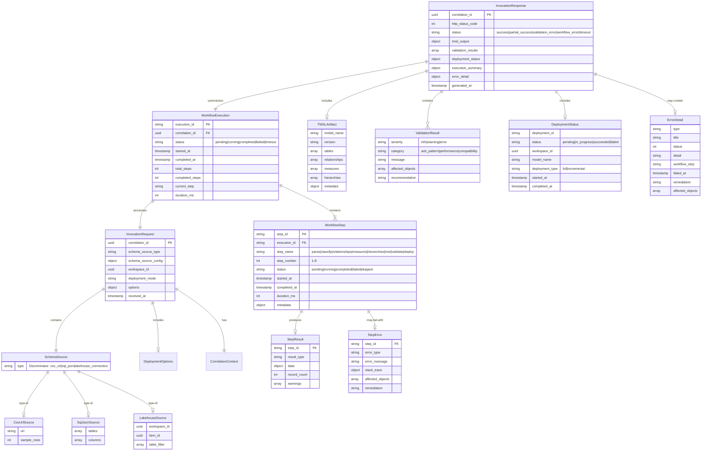
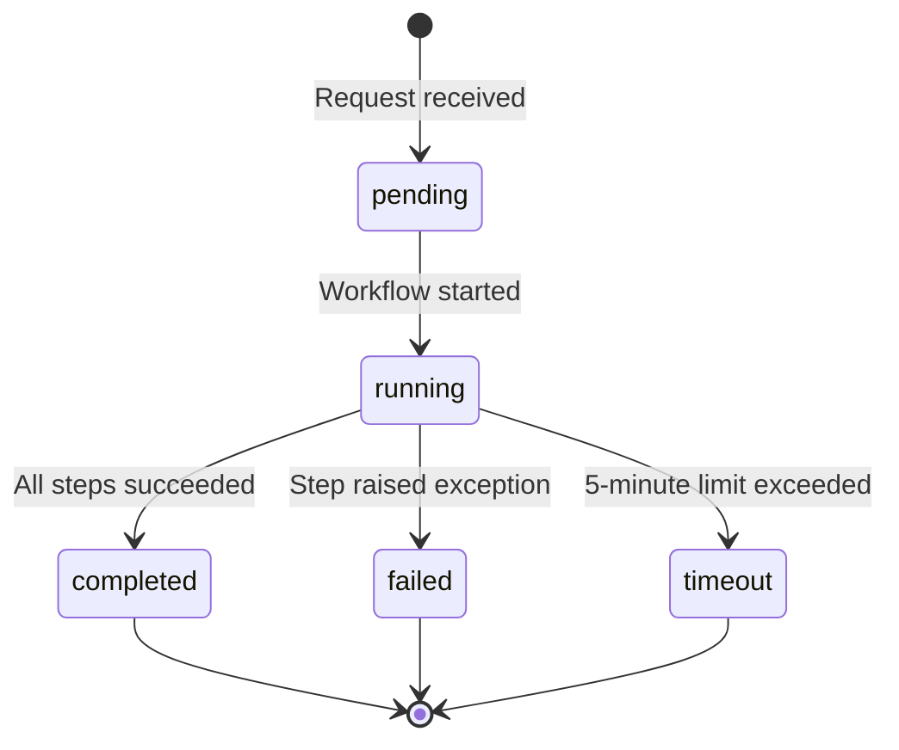

# Data Model: Agent Invocation Handler

**Feature**: Agent Invocation Handler  
**Branch**: 002-agent-invocation-handler  
**Date**: 2026-02-06  
**Phase**: Phase 1 - Data Model Design

## Overview

This document defines the data entities for the Agent Invocation Handler. Since the handler is stateless and processes synchronous HTTP requests, these entities represent request/response contracts and in-memory execution state rather than persisted database models.

## Entity Relationship Diagram

<!-- BEGIN:AUTO-GENERATED section="er-diagram" -->

<!-- END:AUTO-GENERATED -->

## Entity Definitions

### InvocationRequest

Represents the incoming HTTP POST request from Azure AI Foundry containing schema source configuration and processing options.

**Attributes**:
- `correlation_id` (UUID, PK): Unique identifier for request tracing, from `X-Correlation-ID` header or generated
- `schema_source` (SchemaSource): Polymorphic input defining data source type and configuration
- `workspace_id` (UUID): Target Microsoft Fabric workspace for model deployment
- `deployment_mode` (enum): Processing mode - `dry_run`, `validate_only`, or `auto_deploy`  
- `options` (DeploymentOptions): Processing flags like `detect_measures`, `detect_hierarchies`, `target_optimization`
- `received_at` (timestamp): Request arrival time for latency tracking

**Validation Rules**:
- `correlation_id`: Must be valid UUID v4 format
- `schema_source.type`: Must be one of `csv_url`, `sql_json`, `lakehouse_connection`
- `workspace_id`: Must be valid UUID format (can be zeros for MVP dry-run)
- `deployment_mode`: Must be one of allowed enum values
- `options.target_optimization`: If provided, must be `import`, `direct_query`, or `direct_lake`

**Lifecycle**: Created from HTTP request body, validated by Pydantic, passed to workflow executor, discarded after response sent

---

### SchemaSource (Polymorphic Type)

Discriminated union representing different data source types with variant-specific configurations.

**Variants**:

#### CsvUrlSource
- `type`: `"csv_url"` (discriminator)
- `url`: HTTP/HTTPS URL to CSV file (must be accessible without auth or use SAS token)
- `sample_rows`: Number of rows to sample for schema inference (default: 100, max: 1000)

**Validation**: URL must be valid HTTP/HTTPS, sample_rows between 1-1000

#### SqlJsonSource  
- `type`: `"sql_json"` (discriminator)
- `tables`: Array of table definitions with columns, data types, constraints
- `foreign_keys`: Array of foreign key relationships (optional)

**Validation**: Tables array non-empty, each table has name and columns

#### LakehouseSource
- `type`: `"lakehouse_connection"` (discriminator)
- `workspace_id`: UUID of Fabric workspace containing Lakehouse
- `item_id`: UUID of Lakehouse item
- `table_filter`: Array of table name patterns to include (optional, default: all tables)

**Validation**: workspace_id and item_id must be valid UUIDs

---

### WorkflowExecution

Tracks the execution state of the 8-step workflow pipeline from start to completion or failure.

**Attributes**:
- `execution_id` (string, PK): Unique identifier for this workflow run (UUID v4)
- `correlation_id` (UUID, FK): Links to InvocationRequest
- `status` (enum): Current execution status - `pending`, `running`, `completed`, `failed`, `timeout`
- `started_at` (timestamp): Workflow start time
- `completed_at` (timestamp, nullable): Workflow completion time
- `total_steps` (int): Always 8 for full workflow
- `completed_steps` (int): Number of successfully completed steps (0-8)
- `current_step` (string, nullable): Name of currently executing step
- `duration_ms` (int): Total execution time in milliseconds

**State Transitions**:


**Business Rules**:
- `completed_steps` must be <= `total_steps`
- `current_step` is null when status is `pending`, `completed`, `failed`, or `timeout`
- `completed_at` must be >= `started_at` when set
- `duration_ms` = `completed_at` - `started_at` in milliseconds

---

### WorkflowStep

Represents a single step in the 8-step execution pipeline with individual timing and status tracking.

**Attributes**:
- `step_id` (string, PK): Unique identifier for this step execution (UUID v4)
- `execution_id` (string, FK): Links to WorkflowExecution
- `step_name` (enum): Step identifier - `parse`, `classify`, `relationships`, `measures`, `hierarchies`, `tmsl`, `validate`, `deploy`
  -`step_number` (int): Sequential position in workflow (1-8)
- `status` (enum): Step status - `pending`, `running`, `completed`, `failed`, `skipped`
- `started_at` (timestamp, nullable): Step start time
- `completed_at` (timestamp, nullable): Step completion time
- `duration_ms` (int, nullable): Step execution time in milliseconds
- `metadata` (object): Step-specific output metadata (e.g., table count, relationship count)

**Step Sequence**:
1. `parse` - Extract schema from source
2. `classify` - Identify fact/dimension tables
3. `relationships` - Detect foreign key relationships
4. `measures` - Generate DAX measures
5. `hierarchies` - Detect date, geographic hierarchies
6. `tmsl` - Generate TMSL artifact
7. `validate` - Run anti-pattern checks
8. `deploy` - Invoke Fabric deployment API

**Business Rules**:
- Steps execute sequentially in `step_number` order
- Failed step prevents subsequent steps (status becomes `skipped`)
- `completed_at` must be >= `started_at` when both set
- `metadata` content varies by `step_name`

---

### InvocationResponse

The HTTP response returned to Azure AI Foundry after workflow completion (success or failure).

**Attributes**:
- `correlation_id` (UUID, PK): Matches InvocationRequest for tracing
- `http_status_code` (int): HTTP status - `200` (success), `207` (partial success), `400` (validation error), `500` (workflow error), `504` (timeout)
- `status` (enum): Semantic status - `success`, `partial_success`, `validation_error`, `workflow_error`, `timeout`
- `tmsl_output` (TMSLArtifact, nullable): Generated semantic model artifact (when successful)
- `validation_results` (array[ValidationResult]): Model validation findings
- `deployment_status` (DeploymentStatus, nullable): Deployment progress (when deployment_mode != dry_run)
- `execution_summary` (object): Workflow execution metadata (duration, steps completed, timing breakdown)
- `error_detail` (ErrorDetail, nullable): RFC 7807 error structure (when status is error/timeout)
- `generated_at` (timestamp): Response generation time

**Response Patterns**:

**Success (HTTP 200)**:
```json
{
  "correlation_id": "550e8400-e29b-41d4-a716-446655440000",
  "http_status_code": 200,
  "status": "success",
  "tmsl_output": { "model": {...} },
  "validation_results": [],
  "deployment_status": null,
  "execution_summary": {
    "total_duration_ms": 28430,
    "steps_executed": 8,
    "steps_succeeded": 8
  }
}
```

**Validation Error (HTTP 400)**:
```json
{
  "correlation_id": "550e8400-e29b-41d4-a716-446655440000",
  "http_status_code": 400,
  "status": "validation_error",
  "error_detail": {
    "type": "https://agent.fabric.microsoft.com/errors/invalid-request",
    "title": "Request Validation Failed",
    "status": 400,
    "detail": "schema_source.url is required when type is csv_url",
    "workflow_step": null,
    "remediation": "Provide valid URL in schema_source.url field"
  }
}
```

**Workflow Error (HTTP 500)**:
```json
{
  "correlation_id": "550e8400-e29b-41d4-a716-446655440000",
  "http_status_code": 500,
  "status": "workflow_error",
  "error_detail": {
    "type": "https://agent.fabric.microsoft.com/errors/workflow-failure",
    "title": "Workflow Execution Failed",
    "status": 500,
    "detail": "Circular dependency detected between Order and Customer tables",
    "workflow_step": "relationships",
    "failed_at": "2026-02-06T14:23:45Z",
    "remediation": "Remove circular foreign key constraints",
    "affected_objects": ["Order", "Customer"]
  },
  "execution_summary": {
    "total_duration_ms": 12500,
    "steps_executed": 3,
    "steps_succeeded": 2,
    "steps_failed": 1
  }
}
```

---

## Field Types & Constraints

### Enums

**DeploymentMode**:
- `dry_run`: Generate artifacts without deployment
- `validate_only`: Generate + validate without deployment
- `auto_deploy`: Generate + validate + deploy (requires approval for production)

**WorkflowStatus**:
- `pending`: Workflow created but not started
- `running`: Currently executing steps
- `completed`: All steps succeeded
- `failed`: At least one step failed
- `timeout`: Exceeded 5-minute execution limit

**StepStatus**:
- `pending`: Step not yet started
- `running`: Step currently executing
- `completed`: Step succeeded
- `failed`: Step raised exception
- `skipped`: Step not executed due to prior failure

**ValidationSeverity**:
- `info`: Informational finding (e.g., "Table has 50+ columns")
- `warning`: Best practice violation (e.g., "High cardinality relationship")
- `error`: Critical issue (e.g., "Circular dependency detected")

### Common Patterns

**UUID Fields**: Use Python `uuid.UUID` type, serialized as string in JSON  
**Timestamps**: ISO 8601 format with timezone (e.g., `"2026-02-06T14:23:45.123Z"`)  
**Duration**: Milliseconds as integer  
**URLs**: Validated HTTP/HTTPS URLs only  
**Enums**: String literals, validated against allowed values

## Implementation Notes

1. **Pydantic Models**: All entities implemented as Pydantic v2 models in `src/core/schemas.py`
2. **Discriminated Unions**: Use `Field(discriminator="type")` for SchemaSource polymorphism
3. **Validation**: Leverage Pydantic validators for business rules (e.g., `@field_validator`)
4. **Serialization**: Pydantic `.model_dump(mode="json")` for response serialization
5. **OpenAPI**: FastAPI auto-generates OpenAPI schema from Pydantic models
6. **No ORM**: Entities are in-memory request/response models, no database persistence

## Related Files

- **Implementation**: `src/core/schemas.py` - Pydantic model definitions
- **API Contract**: `specs/002-agent-invocation-handler/contracts/invocation-api.yaml` - OpenAPI specification
- **HTTP Handler**: `src/agent/foundry_handler.py` - Endpoint using these models
- **Tests**: `tests/unit/test_request_validation.py` - Pydantic validation tests
