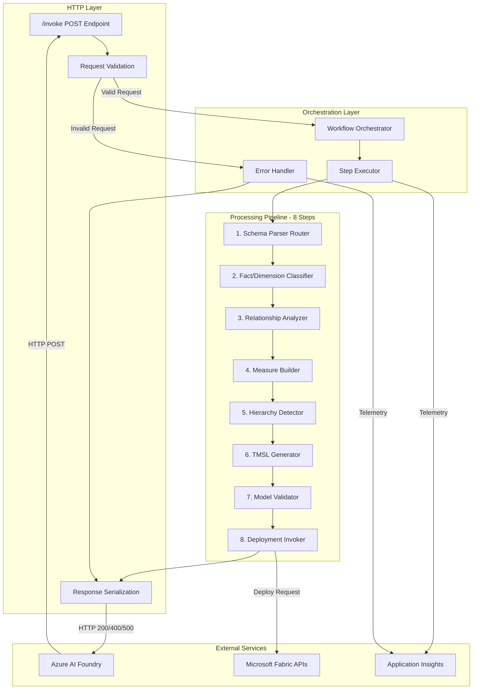

# Implementation Plan: Agent Invocation Handler

**Branch**: `002-agent-invocation-handler` | **Date**: 2026-02-06 | **Spec**: [spec.md](spec.md)
**Input**: Feature specification from `/specs/002-agent-invocation-handler/spec.md`

## Summary

The Agent Invocation Handler implements the core request processing component that serves as the entry point for all semantic modeling requests from Azure AI Foundry. It accepts schema inputs (CSV, SQL, Lakehouse), validates request structure, orchestrates an 8-step modeling workflow (parse → classify → analyze relationships → build measures → detect hierarchies → generate TMSL → validate → deploy), and returns structured TMSL output or detailed error responses. 

**Technical Approach**: FastAPI-based HTTP endpoint (`POST /invoke`) with Pydantic schema validation, orchestrated workflow execution using async Python, Application Insights telemetry integration, and Azure Managed Identity authentication for Fabric API access. The handler implements request/response contract compliance for Azure AI Foundry agent integration and provides comprehensive error handling with correlation ID tracing.

## Technical Context

**Language/Version**: Python 3.11+
**Primary Dependencies**: FastAPI (web framework), Pydantic (validation), azure-ai-projects (Foundry SDK), azure-identity (auth), opentelemetry (instrumentation)
**Storage**: Stateless (no persistent storage - semantic models deployed to Fabric workspaces)
**Testing**: pytest (unit and integration tests), httpx (async HTTP testing), pytest-asyncio (async test support)
**Target Platform**: Azure Container Apps / Azure AI Foundry agent runtime (Linux x64)
**Project Type**: Single monolithic service with HTTP API layer
**Performance Goals**: Process 95% of requests within 30 seconds, handle 10 concurrent requests without degradation, workflow timeout at 5 minutes
**Constraints**: Maximum request payload 10MB, response payload <5MB, synchronous execution only (no async callbacks), HTTP timeout 230 seconds (Azure Container Apps limit)
**Scale/Scope**: MVP handles 3 schema source types (CSV, SQL, Lakehouse), orchestrates 8 workflow steps, supports 3 deployment modes (dry_run, validate_only, auto_deploy)

## Architecture Overview

<!--
  AUTO-GENERATED: This section is populated by /doit.planit based on Technical Context above.
  Shows the high-level system architecture with component layers.
  Regenerate by running /doit.planit again.
-->

<!-- BEGIN:AUTO-GENERATED section="architecture" -->

<!-- END:AUTO-GENERATED -->

## Constitution Check

*GATE: Must pass before Phase 0 research. Re-check after Phase 1 design.*

### Alignment Review

| Principle | Status | Notes |
| :-------- | :----- | :---- |
| **Autonomy & Tooling** | ✅ PASS | Handler is tool-enabled for workflow orchestration. Implements approval gates for production deployments via `deployment_mode` parameter. All actions logged to Application Insights with correlation IDs. |
| **Fabric-First Semantic Modeling** | ✅ PASS | Handler routes to Fabric-specific parsers (Lakehouse), passes Direct Lake optimization hints to TMSL generator, authenticates with Managed Identity for Fabric API access. |
| **Data Governance & Security** | ✅ PASS | Uses Azure Managed Identity (no credential storage), respects data classification in request options, enforces approval gates for production via `deployment_mode: auto_deploy` with `approval_required` flag. |
| **Observability & Validation** | ✅ PASS | Emits telemetry to Application Insights for every request (correlation_id, execution_summary, step timing). Returns structured validation results in response. Implements comprehensive error handling with detailed diagnostics. |
| **Idempotence & Versioning** | ✅ PASS | Handler is stateless and idempotent - same correlation_id produces identical results. Workflow steps accept standardized input/output contracts. Generated TMSL artifacts are versioned via timestamp metadata. |

### Gate Result: ✅ **PASS** - All principles aligned

**Justification**: The handler implements foundational patterns that enable downstream workflow steps to follow constitution principles. It provides the request validation, authentication, orchestration, and telemetry infrastructure required for Fabric-first autonomous semantic modeling with appropriate governance controls.

## Project Structure

### Documentation (this feature)

```text
specs/002-agent-invocation-handler/
├── plan.md              # This file (/doit.planit command output)
├── research.md          # Phase 0 output (/doit.planit command)
├── data-model.md        # Phase 1 output (/doit.planit command)
├── quickstart.md        # Phase 1 output (/doit.planit command)
├── contracts/
│   └── invocation-api.yaml  # OpenAPI spec for /invoke endpoint
├── checklists/
│   └── requirements.md  # Spec quality checklist (from /doit.specit)
└── tasks.md             # Phase 2 output (/doit.taskit command - NOT created by /doit.planit)
```

### Source Code (repository root)

```text
src/agent/
├── __init__.py
├── __main__.py           # FastAPI app entry point (existing)
├── foundry_handler.py    # NEW: Invocation handler endpoint implementation
└── health.py             # Existing health check endpoint

src/core/
├── __init__.py
├── config.py             # Existing Pydantic settings
├── logging.py            # Existing logging setup
└── schemas.py            # NEW: Request/response Pydantic models

src/orchestration/       # NEW: Workflow orchestration module
├── __init__.py
├── workflow_executor.py  # Orchestrates 8-step pipeline
├── workflow_steps.py     # Step execution contracts
└── error_handler.py      # Exception handling and error responses

src/schema_parsers/      # Existing - CSV, SQL, Lakehouse parsers
├── __init__.py
├── csv_parser.py
├── sql_parser.py
├── lakehouse_parser.py
└── tableau_parser.py

src/modeling/            # Existing - downstream workflow steps
├── fact_dimension_detector.py
├── relationship_builder.py
├── measure_builder.py
└── hierarchy_builder.py

src/artifacts/           # Existing - TMSL/TMDL generation
├── tmsl_generator.py
└── tmdl_generator.py

src/validation/          # Existing - model validation
├── anti_pattern_detector.py
└── performance_analyzer.py

src/fabric/              # Existing - Fabric deployment
├── semantic_model_client.py
└── workspace_client.py

tests/
├── unit/
│   ├── test_invocation_handler.py    # NEW: Handler unit tests
│   ├── test_workflow_executor.py     # NEW: Workflow orchestration tests
│   ├── test_request_validation.py    # NEW: Pydantic schema validation tests
│   └── test_error_handler.py         # NEW: Error handling tests
├── integration/
│   ├── test_agent_workflow.py        # Existing - end-to-end tests
│   └── test_handler_e2e.py           # NEW: Handler integration tests with mocked parsers
└── contract/                      # NEW: API contract tests
    ├── test_invocation_schema.py  # Validates request/response conform to OpenAPI spec
    └── test_foundry_compatibility.py  # Validates Azure AI Foundry integration contract
```

**Structure Decision**: Single project monolithic structure (existing pattern). The Agent Invocation Handler adds new modules to the existing `src/agent/` directory for HTTP endpoint handling and creates a new `src/orchestration/` module for workflow execution logic. This maintains consistency with the existing codebase structure where workflow steps are organized by domain (schema_parsers, modeling, artifacts, validation, fabric). All handler-specific logic is isolated in `src/agent/foundry_handler.py` and `src/core/schemas.py` for request/response models. The orchestration layer acts as the glue between the HTTP layer and existing workflow components.

## Complexity Tracking

*No constitution violations - this section is not applicable.*

**rationale**: All technical decisions align with established patterns:
- Uses existing Python 3.11+ stack
- Leverages existing FastAPI framework in `src/agent/__main__.py`
- Follows established single-project monolithic structure
- Integrates with existing workflow components (parsers, modeling, artifacts, validation, fabric)
- No new framework introductions or architectural deviations
