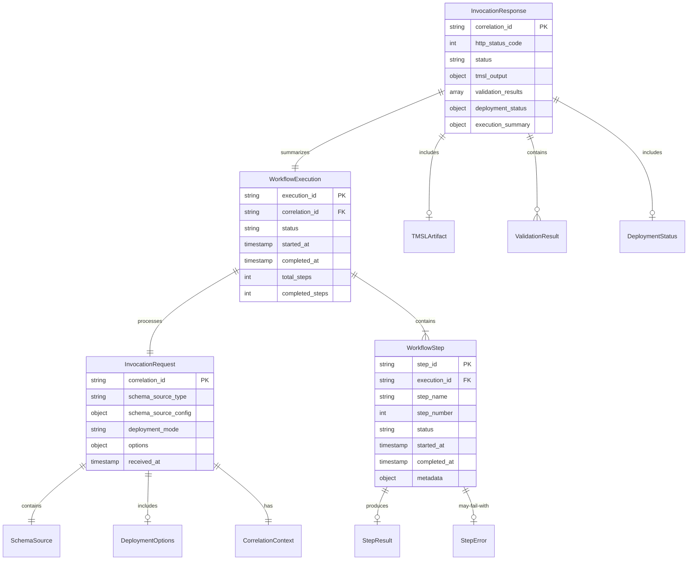

# Feature Specification: Agent Invocation Handler

**Feature Branch**: `002-agent-invocation-handler`  
**Created**: 2026-02-06  
**Status**: Draft  
**Input**: Agent Invocation Handler - Entry point that receives requests from Foundry and orchestrates the 8-step workflow

## Summary

The Agent Invocation Handler is the core request processing component that serves as the entry point for all semantic modeling requests from Azure AI Foundry. It receives schema input (CSV, SQL, Lakehouse), validates request structure, orchestrates the 8-step modeling workflow, and returns structured results or error responses. This handler implements the request/response contract that enables Foundry integration and provides the foundation for all agent capabilities.

## User Scenarios & Testing

### User Story 1 - Process CSV Schema Request (Priority: P1)

A data engineer submits a CSV URL to generate a Power BI semantic model. The handler receives the request from Foundry, validates the schema source, initiates the 8-step workflow (parse → classify → analyze relationships → build measures → generate hierarchies → create model → validate → deploy), and returns the generated TMSL definition with deployment metadata.

**Why this priority**: This is the minimum viable functionality required for the agent to process any request from Foundry. Without this, the agent cannot accept or respond to user inputs. CSV is the simplest input format and proves the handler can orchestrate the complete workflow.

**Independent Test**: Send a POST request with CSV URL to the handler endpoint, verify it returns valid TMSL output and execution metadata within response time limits.

**Acceptance Scenarios**:

1. **Given** a valid CSV schema URL in the request, **When** the handler processes the invocation, **Then** it returns HTTP 200 with valid TMSL structure and workflow execution summary
2. **Given** a request with `dry_run: true`, **When** the handler completes processing, **Then** it returns the model definition without initiating actual Fabric deployment
3. **Given** a request with `deployment_mode: "validate_only"`, **When** processing completes, **Then** the response includes validation results but no deployment status

---

### User Story 2 - Handle SQL Schema Input (Priority: P2)

A database administrator provides SQL INFORMATION_SCHEMA export to generate a semantic model. The handler accepts SQL metadata format, routes to the SQL parser, orchestrates the workflow, and returns results using the same response structure as CSV processing.

**Why this priority**: SQL is the second most common enterprise data source format. Supporting this proves the handler can route to multiple parser implementations and abstract the underlying schema source from downstream workflow steps.

**Independent Test**: Submit SQL metadata request, verify the handler correctly invokes SQL parser and produces valid TMSL output regardless of source format.

**Acceptance Scenarios**:

1. **Given** a valid SQL schema JSON payload, **When** the handler routes to SQL parser, **Then** workflow proceeds identically to CSV processing path
2. **Given** SQL schema with foreign key constraints, **When** relationship analysis runs, **Then** the generated model includes inferred relationships from SQL metadata

---

### User Story 3 - Process Lakehouse/Warehouse Schema (Priority: P2)

A Fabric workspace user connects their Lakehouse or Warehouse to generate Direct Lake optimized semantic models. The handler accepts Fabric lakehouse identifiers, authenticates to Fabric using managed identity, retrieves schema metadata, and orchestrates the workflow with Direct Lake specific optimizations enabled.

**Why this priority**: Native Fabric integration is critical for enterprise adoption and Direct Lake performance benefits. This proves the handler can work with authenticated external services and pass optimization hints through the workflow.

**Independent Test**: Provide Lakehouse workspace and item IDs, verify handler authenticates, retrieves schema, and generates Direct Lake compatible model definition.

**Acceptance Scenarios**:

1. **Given** valid Fabric workspace ID and lakehouse item ID, **When** handler authenticates with managed identity, **Then** it successfully retrieves lakehouse schema metadata
2. **Given** lakehouse schema request with `target_optimization: "direct_lake"`, **When** workflow completes, **Then** generated model uses Direct Lake compatible data types and relationships

---

### User Story 4 - Handle Request Validation Errors (Priority: P1)

A user submits a malformed request with missing required fields. The handler validates the request schema before starting the workflow, identifies validation errors, and returns a structured error response with specific field-level feedback indicating which parameters are missing or invalid.

**Why this priority**: Error handling is essential for P1 because it prevents wasted compute on invalid requests and provides actionable feedback to users. Without this, the agent would fail cryptically or process garbage inputs.

**Independent Test**: Send requests with various missing/invalid fields, verify handler returns HTTP 400 with clear error messages before attempting any workflow processing.

**Acceptance Scenarios**:

1. **Given** a request missing `schema_source`, **When** validation runs, **Then** handler returns HTTP 400 with error message "schema_source is required"
2. **Given** a request with invalid `deployment_mode` value, **When** validation runs, **Then** response includes "deployment_mode must be one of: dry_run, validate_only, auto_deploy"
3. **Given** a request with `schema_source.type: "csv_url"` but no `url` field, **When** validation runs, **Then** error specifies "url is required when type is csv_url"

---

### User Story 5 - Manage Workflow Failures Gracefully (Priority: P1)

During processing, the relationship analysis step fails due to circular dependency detection. The handler catches the workflow exception, logs diagnostic information with correlation ID, and returns HTTP 500 with structured error details including the failed workflow step, error message, and troubleshooting guidance.

**Why this priority**: Failure handling is P1 because real-world data contains errors and edge cases. The handler must provide debugging context to users and prevent silent failures or incomplete results.

**Independent Test**: Inject a workflow failure (mock or via known problematic schema), verify handler logs the exception and returns actionable error response without crashing.

**Acceptance Scenarios**:

1. **Given** a workflow step raises an exception, **When** the handler catches it, **Then** response includes HTTP 500, workflow step name, error message, and correlation ID for support
2. **Given** relationship analysis detects circular dependency, **When** error handling runs, **Then** response provides specific tables/columns involved in the circular relationship
3. **Given** any workflow failure, **When** handler generates error response, **Then** Application Insights receives telemetry with exception details and correlation ID

---

### User Story 6 - Stream Progress Updates for Long Operations (Priority: P3)

A user processes a large SQL schema with 100+ tables. The handler provides streaming progress updates as each workflow step completes, allowing the Foundry UI to display real-time status (e.g., "Parsing schema: 45/100 tables processed", "Building relationships: 23 relationships detected").

**Why this priority**: Progress feedback improves user experience for long-running operations but is not essential for MVP functionality. Basic request/response works without streaming.

**Independent Test**: Submit a large schema request, verify handler emits progress events that can be consumed by Foundry or logged for visibility.

**Acceptance Scenarios**:

1. **Given** a request to process 100+ tables, **When** each workflow step progresses, **Then** handler emits progress events with step name and completion percentage
2. **Given** streaming progress is enabled, **When** relationship analysis runs, **Then** progress updates include "Analyzing relationships: X of Y tables processed"

---

### Edge Cases

- What happens when the request payload exceeds size limits (e.g., 10MB+ inline CSV data)?
  - Handler validates payload size before processing and returns HTTP 413 (Payload Too Large) with guidance to use URL-based schema sources
- How does the handler manage concurrent requests to avoid resource exhaustion?
  - Implements request queuing or rate limiting to cap concurrent workflow executions based on available compute resources
- What happens if Foundry connection times out during response delivery?
  - Handler implements timeout handling and may persist partial results for later retrieval via correlation ID lookup
- How does the handler deal with partial workflow failures (e.g., measures generated but hierarchies failed)?
  - Returns partial success response (HTTP 207 Multi-Status) with completed steps included and failed steps documented in error array
- What if authentication credentials for Lakehouse access are invalid or expired?
  - Handler validates credentials before starting workflow and returns HTTP 401 with specific authentication guidance

## User Journey Visualization

<!-- BEGIN:AUTO-GENERATED section="user-journey" -->

<!-- END:AUTO-GENERATED -->

## Entity Relationships

<!-- BEGIN:AUTO-GENERATED section="entity-relationships" -->

<!-- END:AUTO-GENERATED -->

## Requirements

### Functional Requirements

- **FR-001**: Handler MUST accept POST requests conforming to the Invocation Request Schema (correlation_id, schema_source, workspace_id, deployment_mode, options)
- **FR-002**: Handler MUST validate all required fields are present before initiating workflow processing
- **FR-003**: Handler MUST support three schema source types: csv_url (with URL validation), sql_json (inline JSON payload), lakehouse_connection (workspace_id + item_id)
- **FR-004**: Handler MUST validate deployment_mode is one of: dry_run, validate_only, auto_deploy (with approval_required flag for auto_deploy)
- **FR-005**: Handler MUST generate unique execution_id for each invocation and include in response + telemetry
- **FR-006**: Handler MUST orchestrate the 8-step workflow in sequence: parse schema → classify fact/dimension → analyze relationships → build measures → detect hierarchies → generate TMSL → validate model → invoke deployment
- **FR-007**: Handler MUST return HTTP 200 on successful workflow execution with complete TMSL artifact and execution summary
- **FR-008**: Handler MUST return HTTP 400 for validation failures with field-specific error messages
- **FR-009**: Handler MUST return HTTP 500 for workflow execution failures with failed step name, error message, and correlation ID
- **FR-010**: Handler MUST log all invocations (request, response, duration) to Application Insights with correlation_id as custom dimension
- **FR-011**: Handler MUST support optional X-Correlation-ID header to enable end-to-end request tracing across Foundry and agent systems
- **FR-012**: Handler MUST timeout long-running workflow executions after 5 minutes (configurable) and return HTTP 504 with partial results if available
- **FR-013**: Handler MUST authenticate Lakehouse schema sources using Azure Managed Identity credentials
- **FR-014**: Handler MUST pass target_optimization hint (import, direct_query, direct_lake) through to TMSL generator when specified in request options
- **FR-015**: Handler MUST include workflow execution metadata in response: total_duration_ms, steps_executed, steps_succeeded, steps_failed

### Key Entities

- **InvocationRequest**: Represents the input from Foundry containing schema source configuration, deployment mode,workspace ID, and processing options. Core attributes: correlation_id (unique identifier), schema_source (type + config), deployment_mode (enum), options (object with detect_measures, detect_hierarchies, target_optimization flags)

- **SchemaSource**: Polymorphic input type with three variants: csv_url (url + optional sample_rows), sql_json (inline tables/columns JSON), lakehouse_connection (workspace_id + item_id + optional table_filter). Each variant provides schema metadata in different format but uniform interface for parser selection.

- **WorkflowExecution**: Tracks the progression through 8 workflow steps with status, timing, and results for each step. Maintains execution state: pending → running → completed/failed. Includes total_steps, completed_steps, current_step pointers.

- **WorkflowStep**: Individual step in the execution pipeline (parse, classify, relationship_analysis, measure_builder, hierarchy_detection, tmsl_generation, validation, deployment). Each step has: step_number (1-8), status (pending/running/completed/failed), started_at/completed_at timestamps, output (step-specific result object).

- **InvocationResponse**: Structured output returned to Foundry containing TMSL artifact, validation results, deployment status, execution summary, and any errors. HTTP status code determines success (200), validation error (400), or runtime error (500). Includes correlation_id for request tracing.

- **TMSLArtifact**: The generated Tabular Model Scripting Language JSON structure representing the semantic model with tables, columns, relationships, measures, hierarchies. Embedded in successful responses.

- **ValidationResult**: Array of validation findings from model validation step, each with severity (info/warning/error), category (anti_pattern/performance/compatibility), message, and affected_objects (table/column/relationship references).

- **DeploymentStatus**: Tracks deployment lifecycle when deployment_mode is not dry_run. Contains: deployment_id (Fabric deployment identifier), status (pending/in_progress/succeeded/failed), workspace_id, model_name, deployment_type (full/incremental).

## Success Criteria

### Measurable Outcomes

- **SC-001**: Handler processes 95% of valid CSV requests within 30 seconds from request receipt to response delivery
- **SC-002**: Handler correctly validates request schema and returns HTTP 400 with field-specific errors for 100% of malformed requests
- **SC-003**: Handler successfully orchestrates the complete 8-step workflow for valid requests, with no silent failures or incomplete executions
- **SC-004**: Handler logs request/response pairs to Application Insights with correlation IDs, achieving 100% telemetry coverage for debugging
- **SC-005**: Handler returns structured error responses (HTTP 500 with workflow step name + error message) for 100% of workflow failures
- **SC-006**: Handler handles 10 concurrent requests without resource exhaustion, degradation beyond 2x normal latency, or request failures due to resource contention
- **SC-007**: Handler timeout mechanism prevents any single request from blocking resources beyond 5 minutes, returning HTTP 504 with partial results when applicable
- **SC-008**: Handler supports all three schema source types (CSV, SQL, Lakehouse) with identical response structure and execution flow

## Assumptions

- **A-001**: Azure AI Foundry will send POST requests to a well-known endpoint (e.g., `/invoke` or `/api/process`) with JSON payload matching the Invocation Request Schema
- **A-002**: Schema source URLs (for csv_url type) are publicly accessible or pre-authenticated via SAS tokens - handler does not manage credential storage for external URLs
- **A-003**: Lakehouse/Warehouse authentication uses Azure Managed Identity configured during agent deployment - no user credentials are stored or passed in request
- **A-004**: The 8-step workflow is synchronous and blocking - each step completes before the next begins (streaming progress updates are async telemetry, not workflow parallelization)
- **A-005**: Request payload size is limited to 10MB to prevent memory exhaustion - larger schemas must use URL-based sources
- **A-006**: Foundry provides correlation_id or handler generates UUID v4 if not provided in request headers
- **A-007**: Workflow steps are idempotent - retrying a failed request with same correlation_id produces identical results (no side effects from partial runs)
- **A-008**: Deployment step (when enabled) calls Azure Fabric REST APIs which may have independent rate limits - handler does not manage Fabric quota

## Dependencies

- **D-001**: Azure AI Foundry infrastructure must route invocation requests to the agent container/endpoint
- **D-002**: Schema parser implementations (CSV, SQL, Lakehouse) must be available and expose consistent schema extraction interfaces
- **D-003**: Workflow step implementations (classifier, relationship builder, measure builder, hierarchy detector, TMSL generator) must exist and accept standardized input/output contracts
- **D-004**: Application Insights connection must be configured for telemetry logging
- **D-005**: Azure Managed Identity must have Reader access to Fabric workspaces for Lakehouse schema retrieval
- **D-006**: Foundry agent registration (from 001-foundry-agent-registration) must be completed so Foundry knows the invocation endpoint URL

## Out of Scope

- **OS-001**: Batch processing of multiple schema sources in a single request - handler processes one schema per invocation
- **OS-002**: Long-running async operations with callback/webhook notifications - all processing is synchronous with timeout handling
- **OS-003**: User-specific authentication or authorization - handler assumes Foundry pre-validates user permissions before routing request
- **OS-004**: Caching or memoization of workflow results - each request is processed independently
- **OS-005**: Retry logic for transient Fabric API failures during deployment - calling code (Foundry or user) is responsible for retries
- **OS-006**: Schema version management or incremental updates to existing models - handler produces new model definitions only
- **OS-007**: Custom workflow step injection or plugin architecture - workflow steps are fixed at 8 predefined operations
- **OS-008**: UI components or visualization of workflow progress - handler returns structured JSON, rendering is Foundry's responsibility

## Risks & Mitigations

| Risk | Impact | Mitigation |
| :--- | :----- | :--------- |
| Workflow timeout (5 min) insufficient for very large schemas (1000+ tables) | Users cannot process large enterprise data warehouses via single invocation | Implement configurable timeout via request option, provide guidance on table filtering for initial MVP, plan for async processing in future |
| Memory exhaustion from processing 10MB inline SQL JSON payloads | Handler crashes or becomes unresponsive under concurrent load | Enforce strict payload size limit (10MB), stream large payloads instead of loading fully into memory, provide clear error guidance to use csv_url for large schemas |
| Circular dependency or invalid relationships cause workflow to fail, blocking all downstream steps | Users get incomplete results without TMSL output | Implement granular error handling allowing partial results (e.g., tables + columns + measures even if relationships failed), return HTTP 207 Multi-Status |
| Foundry request timeout is shorter than handler workflow duration | Foundry times out before handler completes, user sees error despite successful background processing | Add early response pattern: return HTTP 202 Accepted immediately, process asynchronously, provide status polling endpoint (future enhancement) |
| Managed Identity credentials invalid or lack Fabric workspace permissions | Lakehouse schema retrieval fails with HTTP 403 | Validate credentials during handler startup, return clear HTTP 401 error with setup instructions, log auth failures to Application Insights for diagnostics |

## Constraints

- **C-001**: Handler must complete workflow execution within Azure Container Apps timeout limits (default 230 seconds for HTTP requests)
- **C-002**: Maximum request payload size is 10MB (enforced by reverse proxy or application middleware)
- **C-003**: Handler cannot persist state between requests - all execution context must be in-memory or passed through workflow steps
- **C-004**: Handler must use Azure Managed Identity for authentication - no username/password or API key storage
- **C-005**: Response size should not exceed 5MB to avoid Foundry integration issues - use references/URLs for large TMSL outputs if needed
- **C-006**: Handler must expose HTTP endpoint compatible with Azure AI Foundry agent invocation protocol (likely HTTP POST with JSON request/response)

## Notes

- Handler implementation should use FastAPI or similar async Python framework to support concurrent request handling efficiently
- Consider using background tasks (FastAPI BackgroundTasks) for optional progress telemetry emission without blocking response
- Correlation ID propagation is critical for debugging production issues - ensure it flows through all workflow steps and appears in all log messages
- Workflow step interfaces should accept correlation_id as parameter to enable step-level telemetry attribution
- Error responses should include troubleshooting hints (e.g., "Check that workspace_id exists and Managed Identity has Reader permissions")
- Consider adding request validation as a separate middleware layer before handler to keep core logic focused on orchestration
