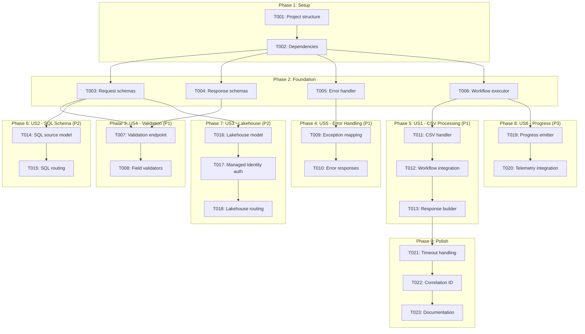
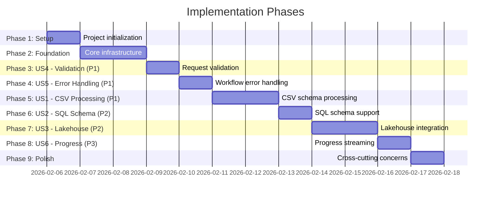

# Tasks: Agent Invocation Handler

**Input**: Design documents from `/specs/002-agent-invocation-handler/`
**Prerequisites**: [plan.md](plan.md), [spec.md](spec.md), [research.md](research.md), [data-model.md](data-model.md), [contracts/invocation-api.yaml](contracts/invocation-api.yaml)

**Organization**: Tasks are grouped by user story to enable independent implementation and testing of each story.

## Task Dependencies

<!--
  AUTO-GENERATED: This section is populated by /doit.taskit based on task relationships.
  The flowchart shows task execution order and parallel opportunities.
  Regenerate by running /doit.taskit again.
-->

<!-- BEGIN:AUTO-GENERATED section="task-dependencies" -->

<!-- END:AUTO-GENERATED -->

## Phase Timeline

<!--
  AUTO-GENERATED: This section is populated by /doit.taskit based on phase structure.
  The gantt chart shows estimated phase durations and dependencies.
  Regenerate by running /doit.taskit again.
-->

<!-- BEGIN:AUTO-GENERATED section="phase-timeline" -->

<!-- END:AUTO-GENERATED -->

## Format: `[ID] [P?] [Story] Description`

- **[P]**: Can run in parallel (different files, no dependencies)
- **[Story]**: Which user story this task belongs to (e.g., US1, US2, US3)
- Include exact file paths in descriptions

---

## Phase 1: Setup (Shared Infrastructure)

**Purpose**: Project initialization and basic structure

- [x] T001 Create orchestration module directory structure at src/orchestration/
- [x] T002 Install FastAPI, Pydantic v2, azure-identity, azure-ai-projects dependencies in requirements.txt

---

## Phase 2: Foundational (Blocking Prerequisites)

**Purpose**: Core infrastructure that MUST be complete before ANY user story can be implemented

**⚠️ CRITICAL**: No user story work can begin until this phase is complete

- [x] T003 [P] Create InvocationRequest Pydantic model with discriminated union SchemaSource in src/core/schemas.py
- [x] T004 [P] Create InvocationResponse, TMSLArtifact, ValidationResult Pydantic models in src/core/schemas.py
- [x] T005 [P] Implement RFC 7807 ProblemDetails error response model in src/orchestration/error_handler.py
- [x] T006 Create WorkflowExecutor class with async execute() method in src/orchestration/workflow_executor.py

**Checkpoint**: Foundation ready - user story implementation can now begin in parallel

---

## Phase 3: User Story 4 - Handle Request Validation Errors (Priority: P1) 🎯 MVP

**Goal**: Validate incoming requests and return HTTP 400 with field-specific errors for malformed inputs

**Independent Test**: Send POST request with missing `schema_source` field, verify handler returns HTTP 400 with error message "schema_source is required"

### Implementation for User Story 4

- [x] T007 [US4] Create POST /invoke endpoint in src/agent/foundry_handler.py with FastAPI route decorator
- [x] T008 [US4] Add Pydantic field validators for deployment_mode enum and schema_source type validation in src/core/schemas.py

**Checkpoint**: At this point, request validation should reject invalid inputs with structured error responses

---

## Phase 4: User Story 5 - Manage Workflow Failures Gracefully (Priority: P1) 🎯 MVP

**Goal**: Catch workflow exceptions and return HTTP 500 with structured error details including failed step and correlation ID

**Independent Test**: Inject workflow failure (mock exception in relationship builder), verify handler returns HTTP 500 with step name, error message, and correlation ID

### Implementation for User Story 5

- [x] T009 [US5] Implement exception-to-RFC7807 mapping in src/orchestration/error_handler.py for workflow step failures
- [x] T010 [US5] Add try/catch wrapper in WorkflowExecutor with Application Insights telemetry logging in src/orchestration/workflow_executor.py

**Checkpoint**: At this point, workflow failures should be caught and transformed into actionable error responses

---

## Phase 5: User Story 1 - Process CSV Schema Request (Priority: P1) 🎯 MVP

**Goal**: Accept CSV URL, orchestrate 8-step workflow, return TMSL artifact with execution metadata

**Independent Test**: Send POST request with valid CSV URL, verify handler returns HTTP 200 with valid TMSL structure and workflow execution summary within 30 seconds

### Implementation for User Story 1

- [x] T011 [US1] Implement CsvUrlSource Pydantic model with url and sample_rows fields in src/core/schemas.py
- [x] T012 [US1] Integrate CSV parser routing in WorkflowExecutor.execute() orchestrating 8-step pipeline in src/orchestration/workflow_executor.py
- [x] T013 [US1] Build InvocationResponse with TMSL output, validation results, execution summary in src/agent/foundry_handler.py

**Checkpoint**: At this point, CSV schema requests should complete end-to-end and return structured TMSL output

---

## Phase 6: User Story 2 - Handle SQL Schema Input (Priority: P2)

**Goal**: Accept SQL metadata JSON, route to SQL parser, orchestrate workflow with same response structure as CSV

**Independent Test**: Submit SQL schema request with tables/columns JSON, verify handler invokes SQL parser and produces valid TMSL output

### Implementation for User Story 2

- [ ] T014 [P] [US2] Create SqlJsonSource Pydantic model with tables and columns arrays in src/core/schemas.py
- [ ] T015 [US2] Add SQL parser routing logic to WorkflowExecutor based on schema_source.type discriminator in src/orchestration/workflow_executor.py

**Checkpoint**: At this point, SQL schema requests should work identically to CSV processing path

---

## Phase 7: User Story 3 - Process Lakehouse/Warehouse Schema (Priority: P2)

**Goal**: Accept Fabric Lakehouse identifiers, authenticate with Managed Identity, retrieve schema, orchestrate workflow with Direct Lake optimizations

**Independent Test**: Provide Lakehouse workspace_id and item_id, verify handler authenticates, retrieves schema, and generates Direct Lake compatible model

### Implementation for User Story 3

- [ ] T016 [P] [US3] Create LakehouseSource Pydantic model with workspace_id, item_id, table_filter fields in src/core/schemas.py
- [ ] T017 [US3] Implement Azure Managed Identity credential acquisition using azure-identity DefaultAzureCredential in src/fabric/workspace_client.py
- [ ] T018 [US3] Add Lakehouse schema retrieval and routing in WorkflowExecutor with target_optimization: direct_lake hint in src/orchestration/workflow_executor.py

**Checkpoint**: At this point, Lakehouse schema requests should authenticate and retrieve schema from Fabric APIs

---

## Phase 8: User Story 6 - Stream Progress Updates for Long Operations (Priority: P3)

**Goal**: Emit progress events as each workflow step completes to provide real-time status visibility

**Independent Test**: Submit large schema request, verify handler emits progress events with step name and completion percentage

### Implementation for User Story 6

- [ ] T019 [P] [US6] Create ProgressEvent model and async emit_progress() method in src/orchestration/workflow_executor.py
- [ ] T020 [US6] Integrate progress telemetry emission to Application Insights with correlation_id custom dimension in src/orchestration/workflow_executor.py

**Checkpoint**: At this point, long-running workflows should emit observable progress updates

---

## Phase 9: Polish & Cross-Cutting Concerns

**Purpose**: Final integration, timeouts, correlation ID propagation, documentation

- [ ] T021 Implement 5-minute workflow timeout using asyncio.timeout() in WorkflowExecutor with HTTP 504 response in src/orchestration/workflow_executor.py
- [ ] T022 [P] Add X-Correlation-ID header handling and UUID generation fallback in src/agent/foundry_handler.py
- [ ] T023 [P] Update API documentation with curl examples and error response patterns in docs/api/invocation-handler.md

---

## Implementation Strategy

### MVP Scope (Immediate Delivery)

The following phases constitute the Minimum Viable Product:

- **Phase 1**: Setup
- **Phase 2**: Foundational infrastructure
- **Phase 3**: User Story 4 - Request Validation (P1)
- **Phase 4**: User Story 5 - Workflow Error Handling (P1)
- **Phase 5**: User Story 1 - CSV Processing (P1)

**Estimated Duration**: 5-6 days

**Deliverable**: Agent can accept CSV URL requests from Foundry, validate inputs, orchestrate the 8-step workflow, return TMSL output or structured errors, and log telemetry to Application Insights.

### Post-MVP Increments

**Increment 2** (SQL & Lakehouse Support):
- Phase 6: User Story 2 - SQL Schema (P2) - 1 day
- Phase 7: User Story 3 - Lakehouse Integration (P2) - 2 days

**Increment 3** (Enhanced UX):
- Phase 8: User Story 6 - Progress Streaming (P3) - 1 day
- Phase 9: Polish & Cross-Cutting Concerns - 1 day

### Parallel Execution Opportunities

Tasks marked with `[P]` can be executed in parallel **within the same phase**:

**Phase 2 Foundation** (4 parallel tasks):
- T003: Request schemas
- T004: Response schemas
- T005: Error handler
- T006: Workflow executor

**Phase 6 SQL Support** (1 parallelizable task):
- T014: SqlJsonSource model (can be written while T015 routing logic is being implemented)

**Phase 7 Lakehouse Support** (1 parallelizable task):
- T016: LakehouseSource model (can be written in parallel with T017 auth implementation)

**Phase 8 Progress Streaming** (1 parallelizable task):
- T019: ProgressEvent model (can be written in parallel with T020 telemetry integration)

**Phase 9 Polish** (2 parallel tasks):
- T022: Correlation ID handling
- T023: Documentation updates

### Task Count Summary

- **Total Tasks**: 23
- **Phase 1 - Setup**: 2 tasks
- **Phase 2 - Foundation**: 4 tasks (4 parallelizable)
- **Phase 3 - US4 Validation (P1)**: 2 tasks
- **Phase 4 - US5 Error Handling (P1)**: 2 tasks
- **Phase 5 - US1 CSV Processing (P1)**: 3 tasks
- **Phase 6 - US2 SQL Schema (P2)**: 2 tasks (1 parallelizable)
- **Phase 7 - US3 Lakehouse (P2)**: 3 tasks (1 parallelizable)
- **Phase 8 - US6 Progress (P3)**: 2 tasks (1 parallelizable)
- **Phase 9 - Polish**: 3 tasks (2 parallelizable)

**Parallel Opportunities**: 10 tasks can run concurrently with others in their phase

---

## Dependencies & Blockers

### External Dependencies

- **Azure AI Foundry**: Agent registration (from 001-foundry-agent-registration) must be completed so Foundry knows the `/invoke` endpoint URL
- **Schema Parsers**: CSV, SQL, Lakehouse parser implementations must expose consistent schema extraction interfaces
- **Workflow Steps**: Classifier, relationship builder, measure builder, hierarchy detector, TMSL generator must accept standardized input/output contracts
- **Application Insights**: Connection string must be configured for telemetry logging
- **Azure Managed Identity**: Must have Reader access to Fabric workspaces for Lakehouse schema retrieval (T017)

### Phase Dependencies

- **Phase 3-9** depend on **Phase 2** completion (foundational infrastructure)
- **Phase 5** (US1 CSV) depends on **Phase 3** (validation) and **Phase 4** (error handling)
- **Phase 6** (US2 SQL) and **Phase 7** (US3 Lakehouse) can run in parallel after Phase 5
- **Phase 8** (US6 Progress) depends on **Phase 5** (workflow executor must exist)
- **Phase 9** (Polish) depends on **Phase 5** (timeout handling wraps WorkflowExecutor)

---

## Validation Checklist

Before marking this feature complete, verify:

- [ ] **SC-001**: Handler processes 95% of valid CSV requests within 30 seconds
- [ ] **SC-002**: Handler returns HTTP 400 with field-specific errors for 100% of malformed requests
- [ ] **SC-003**: Handler successfully orchestrates complete 8-step workflow with no silent failures
- [ ] **SC-004**: Handler logs all requests/responses to Application Insights with correlation IDs (100% telemetry coverage)
- [ ] **SC-005**: Handler returns HTTP 500 with workflow step name + error message for 100% of workflow failures
- [ ] **SC-006**: Handler handles 10 concurrent requests without resource exhaustion or >2x latency degradation
- [ ] **SC-007**: Handler timeout mechanism prevents requests from blocking beyond 5 minutes (returns HTTP 504)
- [ ] **SC-008**: Handler supports all three schema source types (CSV, SQL, Lakehouse) with identical response structure

---

## Next Steps

**Recommended**: Run `/doit.implementit` to start executing the implementation tasks beginning with Phase 1 (Setup).
